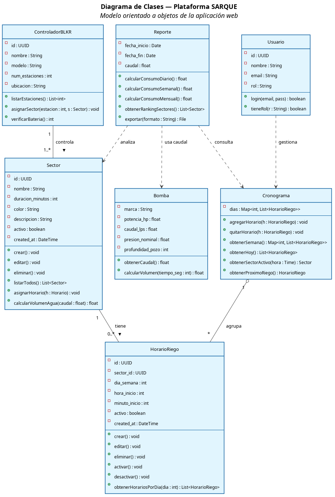
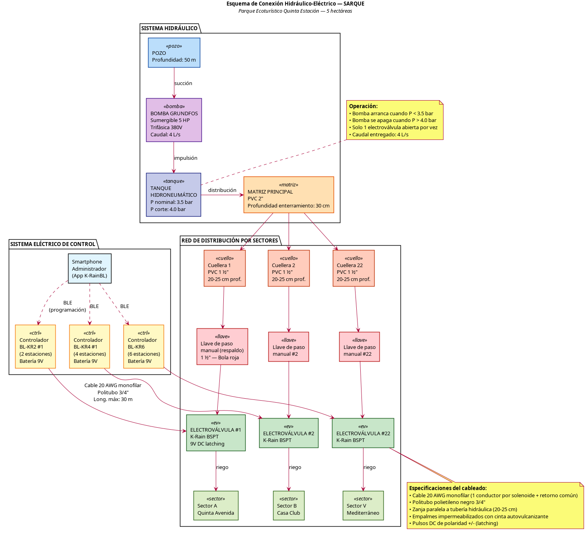
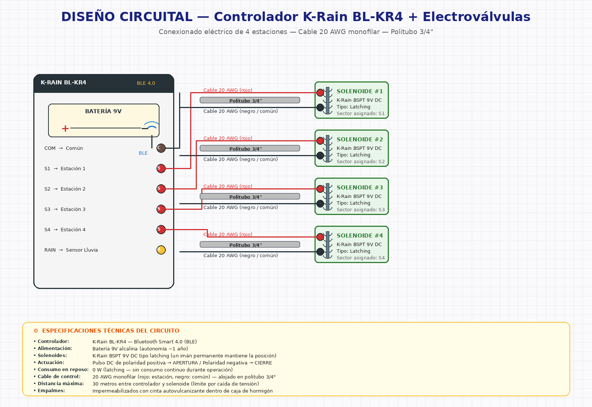

# COMPLEMENTOS DEL DOCUMENTO SARQUE

Este documento complementa el Trabajo Dirigido SARQUE con cuatro elementos solicitados:
1. Desarrollo completo del Modelo DRA
2. Diagrama de Clases
3. Esquema de Conexión Hidráulico-Eléctrico
4. Diseño Circuital

---

# 1. MODELO DE DESARROLLO RÁPIDO DE APLICACIONES (DRA / RAD) APLICADO A SARQUE

## 1.1. Fundamento teórico

El **Desarrollo Rápido de Aplicaciones (DRA)**, propuesto por James Martin en 1991, es una metodología de desarrollo iterativo que prioriza la entrega temprana de prototipos funcionales por sobre la documentación extensiva. Se basa en cuatro principios:

1. **Reducción del tiempo de desarrollo** mediante ciclos iterativos cortos.
2. **Participación activa del usuario final** en cada iteración.
3. **Uso intensivo de componentes reutilizables** y frameworks de generación rápida.
4. **Construcción incremental** con prototipos evolutivos.

## 1.2. Las cuatro fases del DRA y su aplicación en SARQUE

```
┌─────────────────────────────────────────────────────────────────┐
│                    CICLO DE VIDA DRA — SARQUE                   │
├─────────────────────────────────────────────────────────────────┤
│  FASE 1           FASE 2           FASE 3           FASE 4      │
│  Planificación → Diseño del    →  Construcción  →  Transición   │
│  de Requisitos   Usuario          (Rápida)         (Implem.)    │
└─────────────────────────────────────────────────────────────────┘
```

### 1.2.1. FASE 1 — Planificación de Requisitos

Esta fase definió el alcance y los requisitos del sistema mediante reuniones con la propietaria del parque (Sra. Eliana Soria Yapur) y observación directa del trabajo de los 6 jardineros.

**Actividades realizadas:**

| Actividad | Producto generado | Duración |
|-----------|-------------------|----------|
| Entrevista no estructurada a la administración | Identificación del problema central | 2 días |
| Observación directa de jornadas de riego | Diagnóstico operativo | 5 días |
| Relevamiento del plano hídrico del parque | Plano anotado con 41 puntos y red de cañerías | 3 días |
| Documentación del cronograma semanal en papel | Tabla de horarios por sector | 1 día |
| Análisis de requerimientos funcionales y no funcionales | RF01-RF09 / RNF01-RNF06 | 3 días |

**Acuerdo de alcance:**
- Sistema automatizado con 6 controladores BL-KR + 22 electroválvulas.
- Plataforma web complementaria (sin reportes en tiempo real).
- Programación de controladores con app oficial K-RainBL.
- No se requiere ESP32 ni infraestructura WiFi adicional.

### 1.2.2. FASE 2 — Diseño del Usuario

En esta fase se construyeron prototipos visuales de la interfaz web y se validaron con la administración antes de codificar.

**Actividades realizadas:**

| Actividad | Producto generado |
|-----------|-------------------|
| Wireframes de las páginas principales | Bocetos del Dashboard, Cronograma, Sectores, Reportes |
| Definición del modelo de datos | Diagrama Entidad-Relación inicial |
| Diseño de la paleta de colores del cronograma | Códigos de color: amarillo (2h), verde (1.5h), azul (1h) |
| Validación con la propietaria | Iteraciones sobre estructura de cronograma |
| Diseño de arquitectura del sistema | Diagrama de Componentes |

**Iteraciones de diseño:**
- **Iteración 1:** prototipo de Dashboard con sector activo en tiempo real.
- **Iteración 2:** cronograma editable tipo tabla Excel con colores por duración.
- **Iteración 3:** página de reportes con gráficos de barra y ranking de sectores.

### 1.2.3. FASE 3 — Construcción Rápida

Esta fase implementó la plataforma web SARQUE utilizando un stack tecnológico moderno orientado a desarrollo rápido.

**Stack tecnológico utilizado:**

| Capa | Tecnología | Justificación de uso en DRA |
|------|-----------|------------------------------|
| Frontend | React 18 + TypeScript + Vite | Hot Module Reload permite ver cambios al instante |
| UI | Tailwind CSS + shadcn/ui | Componentes accesibles preconstruidos (no se reescribe HTML/CSS desde cero) |
| Backend | Supabase (PostgreSQL + Auth + API REST) | Base de datos sin necesidad de programar API: PostgREST genera endpoints automáticamente |
| Estado | TanStack React Query | Manejo declarativo de datos del servidor con caché automática |
| Validación | Zod | Esquemas de validación tipados que se reutilizan en frontend |
| Hosting | Lovable.dev | Despliegue continuo a cada commit (CI/CD automático) |

**Incrementos del desarrollo:**

| Incremento | Funcionalidad entregada | Semana |
|------------|------------------------|--------|
| INC-1 | Autenticación de usuarios + esquema de BD | Semana 11 |
| INC-2 | CRUD de Sectores (catálogo) | Semana 11 |
| INC-3 | Cronograma visual editable | Semana 12 |
| INC-4 | Dashboard con sector activo en tiempo real | Semana 13 |
| INC-5 | Reportes simulados con gráficos | Semana 14 |
| INC-6 | Eliminación del login (decisión final del usuario) | Semana 14 |

### 1.2.4. FASE 4 — Transición e Implementación

Esta fase puso el sistema en operación real en el parque y capacitó al personal.

**Actividades realizadas:**

| Actividad | Resultado |
|-----------|-----------|
| Despliegue del sitio web SARQUE en producción | URL accesible desde cualquier dispositivo |
| Migración del cronograma de papel a la plataforma | 20 sectores registrados + ~28 horarios semanales |
| Programación física de los 6 controladores BL-KR | Cronograma cargado en cada BL-KR vía K-RainBL |
| Capacitación a la administración | Manual de Usuario SARQUE entregado |
| Pruebas de aceptación en campo | Validación de los 4 escenarios principales |

## 1.3. Ventajas del DRA observadas en SARQUE

- **Reducción del tiempo total** de desarrollo a ~4 semanas para la plataforma web.
- **Retroalimentación temprana**: cambios solicitados por la administración (eliminación del login, eliminación del módulo histórico) se implementaron sin reescribir el sistema.
- **Calidad visible desde el primer incremento**, lo que aumentó la confianza del cliente en el proyecto.
- **Stack moderno** que permite mantenimiento futuro sin dependencias obsoletas.

## 1.4. Cronograma DRA — Diagrama de Gantt resumido

```
Semana:    1   2   3   4   5   6   7   8   9   10  11  12  13  14  15
─────────────────────────────────────────────────────────────────────
F1 Plan:   ███████████
F2 Diseño:         ███████
F3 Const:                  ███████████████████████
F4 Trans:                                              ████████████
```

---

# 2. DIAGRAMA DE CLASES

El diagrama de clases UML del sistema SARQUE modela las entidades principales del dominio y sus relaciones, siguiendo el paradigma orientado a objetos.



*Figura. Diagrama de Clases — Plataforma SARQUE. Fuente: Elaboración propia, 2026.*

## 2.1. Descripción de las clases

### `Sector`
Representa una zona del parque con vegetación específica que recibe riego.
- **Atributos:** id, nombre, duracion_minutos, color, descripcion, activo, created_at
- **Métodos principales:** `crear()`, `editar()`, `eliminar()`, `asignarHorario()`, `calcularVolumenAgua()`

### `HorarioRiego`
Registra cuándo (día y hora) se debe regar un sector específico.
- **Atributos:** id, sector_id, dia_semana, hora_inicio, minuto_inicio, activo
- **Métodos principales:** `crear()`, `activar()`, `desactivar()`, `obtenerHorariosPorDia()`

### `Cronograma`
Clase de servicio que agrupa los horarios y proporciona vistas agregadas (semanal, diaria, próximo riego).
- **Métodos clave:** `obtenerSemana()`, `obtenerHoy()`, `obtenerSectorActivo()`, `obtenerProximoRiego()`

### `Reporte`
Genera reportes simulados de consumo hídrico basados en el cronograma y caudal de la bomba.
- **Métodos:** `calcularConsumoDiario()`, `calcularConsumoSemanal()`, `calcularConsumoMensual()`, `obtenerRankingSectores()`, `exportar()`

### `ControladorBLKR`
Modela un controlador físico K-Rain BL-KR (BL-KR2, BL-KR4 o BL-KR6).
- **Atributos:** id, nombre, modelo, num_estaciones, ubicacion
- **Métodos:** `listarEstaciones()`, `asignarSector()`, `verificarBateria()`

### `Bomba`
Encapsula los parámetros de la bomba sumergible Grundfos.
- **Atributos:** marca, potencia_hp, caudal_lps (= 4), presion_nominal (= 3.5), profundidad_pozo (= 50 m)
- **Métodos:** `obtenerCaudal()`, `calcularVolumen()`

### `Usuario`
Representa al administrador u operador con acceso a la plataforma.
- **Métodos:** `login()`, `tieneRol()`

## 2.2. Relaciones principales

| Relación | Cardinalidad | Significado |
|----------|--------------|-------------|
| `Sector` → `HorarioRiego` | 1 : 0..* | Un sector tiene cero o más horarios programados |
| `ControladorBLKR` → `Sector` | 1 : 1..* | Un controlador gobierna entre 2 y 6 sectores (estaciones) |
| `Cronograma` ◇— `HorarioRiego` | 1 : * | Agregación: el cronograma agrupa todos los horarios activos |
| `Reporte` ---> `Sector`, `Bomba`, `Cronograma` | dependencia | El reporte consulta las tres entidades para calcular consumos |
| `Usuario` ---> `Cronograma` | dependencia | El admin gestiona el cronograma |

---

# 3. ESQUEMA DE CONEXIÓN HIDRÁULICO-ELÉCTRICO

El esquema de conexión muestra cómo se interconectan los componentes hidráulicos (pozo, bomba, tanque, matriz, electroválvulas) con los componentes eléctricos de control (controladores BL-KR, cableado, smartphone).



*Figura. Esquema de Conexión Hidráulico-Eléctrico — SARQUE. Fuente: Elaboración propia, 2026.*

## 3.1. Sistema Hidráulico

```
POZO (50 m profundidad)
   │
   ▼
BOMBA SUMERGIBLE GRUNDFOS 5 HP (trifásica)
   │  caudal: 4 L/s
   ▼
TANQUE HIDRONEUMÁTICO  (P trabajo: 3.5 bar / P corte: 4.0 bar)
   │
   ▼
MATRIZ PRINCIPAL PVC 2"  (enterrada a 30 cm)
   │
   ├──→ Cuellera 1 (PVC 1½", 20-25 cm prof.) → Llave de paso → Electroválvula 1 → Sector A
   ├──→ Cuellera 2 (PVC 1½")                 → Llave de paso → Electroválvula 2 → Sector B
   ├──→ Cuellera ...
   └──→ Cuellera 22 (PVC 1½")                → Llave de paso → Electroválvula 22 → Sector V
```

## 3.2. Sistema Eléctrico de Control

```
SMARTPHONE ADMINISTRADOR (App K-RainBL)
   │   programación vía Bluetooth Low Energy (BLE)
   │
   ├──→ Controlador BL-KR2 #1 (batería 9V)  ──→ Electroválvulas 1, 2
   ├──→ Controlador BL-KR2 #2                ──→ Electroválvulas 3, 4
   ├──→ Controlador BL-KR4 #1                ──→ Electroválvulas 5, 6, 7, 8
   ├──→ Controlador BL-KR4 #2                ──→ Electroválvulas 9, 10, 11, 12
   ├──→ Controlador BL-KR4 #3                ──→ Electroválvulas 13, 14, 15, 16
   └──→ Controlador BL-KR6                   ──→ Electroválvulas 17, 18, 19, 20, 21, 22

   Cable de control: 20 AWG monofilar  |  Politubo: 3/4"  |  Longitud máx: 30 m
```

## 3.3. Especificaciones por subsistema

### Sistema Hidráulico
| Componente | Especificación |
|------------|----------------|
| Bomba | Grundfos 5 HP, sumergible, trifásica 380V |
| Caudal | 4 L/s (14.4 m³/h) |
| Pozo | 50 m de profundidad |
| Tanque hidroneumático | Operación 3.5 – 4.0 bar |
| Matriz principal | PVC 2", enterrada a 30 cm |
| Cuelleras | PVC 1 ½", enterradas a 20-25 cm |
| Llaves de paso de respaldo | Tipo bola, color rojo, 1 ½" |
| Operación | Una sola electroválvula abierta a la vez |

### Sistema Eléctrico
| Componente | Especificación |
|------------|----------------|
| 2× BL-KR2 (2 estaciones c/u) | 4 estaciones |
| 3× BL-KR4 (4 estaciones c/u) | 12 estaciones |
| 1× BL-KR6 (6 estaciones) | 6 estaciones |
| **Total** | **22 estaciones / 6 controladores** |
| Alimentación de controladores | Batería 9V alcalina (autonomía ~1 año) |
| Comunicación con app | Bluetooth Low Energy (BLE 4.0) |
| Cable de control | 20 AWG monofilar |
| Protección | Politubo polietileno 3/4" |
| Profundidad de zanja | 20-25 cm |
| Cajas de válvula | Hormigón armado 40 × 40 × 30 cm |
| Empalmes | Impermeabilizados con cinta autovulcanizante |

---

# 4. DISEÑO CIRCUITAL

El diseño circuital muestra el conexionado eléctrico interno entre un controlador K-Rain BL-KR y sus electroválvulas, ejemplificando con el modelo BL-KR4 (4 estaciones).



*Figura. Diseño Circuital — Controlador BL-KR4 + Electroválvulas. Fuente: Elaboración propia, 2026.*

## 4.1. Componentes del circuito

### Controlador K-Rain BL-KR4
- **Alimentación:** Batería 9V alcalina
- **Salidas:** 4 terminales de estación (S1, S2, S3, S4) + 1 común (COM) + 1 sensor lluvia (RAIN)
- **Comunicación:** Bluetooth Smart 4.0 (BLE) — antena integrada
- **Lógica interna:** Microcontrolador propietario K-Rain que ejecuta el programa cargado por la app K-RainBL

### Electroválvulas K-Rain BSPT
- **Tipo:** Solenoide latching de 9V DC
- **Principio de operación:** Un imán permanente mantiene la posición (abierta o cerrada) sin consumo continuo de corriente
- **Cambio de estado:** Pulso de polaridad positiva → APERTURA / Pulso de polaridad negativa → CIERRE
- **Conexión:** Dos terminales (positivo y negativo) con cables monofilares

### Cable y Protección
- **Cable:** 20 AWG monofilar (1 conductor por estación + retorno común)
- **Politubo:** Polietileno negro 3/4" de diámetro
- **Longitud máxima por estación:** 30 metros (criterio de diseño para evitar caída de tensión)

## 4.2. Topología del cableado

El circuito eléctrico se organiza con un **bus común** (cable negro/azul) compartido por todas las estaciones, y un **cable independiente rojo** para cada estación. Esta topología minimiza la cantidad de conductores necesarios:

```
Controlador BL-KR4
    ├── COM ────●─────●─────●─────●────  (bus común a todos los solenoides)
    │           │     │     │     │
    │           [−]   [−]   [−]   [−]
    │           SOL1  SOL2  SOL3  SOL4
    │           [+]   [+]   [+]   [+]
    │           │     │     │     │
    ├── S1 ─────┘     │     │     │
    ├── S2 ───────────┘     │     │
    ├── S3 ─────────────────┘     │
    └── S4 ───────────────────────┘
```

## 4.3. Cálculo de caída de tensión

Para verificar que el cable 20 AWG sea adecuado a 30 m, se aplica:

> **V_caída = I × R × L × 2**

Donde:
- I = corriente del solenoide en pulso (típica: 100-200 mA en latching)
- R = resistencia del 20 AWG (33.31 Ω/km = 0.0333 Ω/m)
- L = longitud del cable
- × 2 porque considera ida y retorno

Para 30 m a 200 mA:
> V_caída = 0.2 A × 0.0333 Ω/m × 30 m × 2 = **0.4 V**

Esto representa apenas un 4.4 % de los 9V de la batería, **muy por debajo** del límite crítico (típicamente 10 %), lo que confirma que 30 m es una distancia segura para esta topología.

## 4.4. Replicación del diseño para los 6 controladores

| Controlador | Modelo | Estaciones | Cables 20 AWG necesarios |
|-------------|--------|-----------|--------------------------|
| C1 | BL-KR2 | 2 | 3 (2 estaciones + 1 común) |
| C2 | BL-KR2 | 2 | 3 |
| C3 | BL-KR4 | 4 | 5 (4 estaciones + 1 común) |
| C4 | BL-KR4 | 4 | 5 |
| C5 | BL-KR4 | 4 | 5 |
| C6 | BL-KR6 | 6 | 7 (6 estaciones + 1 común) |
| **TOTAL** | | **22 estaciones** | **28 conductores** |

---

*Complementos del Trabajo Dirigido SARQUE — ITSa 2026*
*Postulante: Jose Neyer Arnez Aguilar — Tutor: Ing. Ariel Luis Gruich Arratia*
