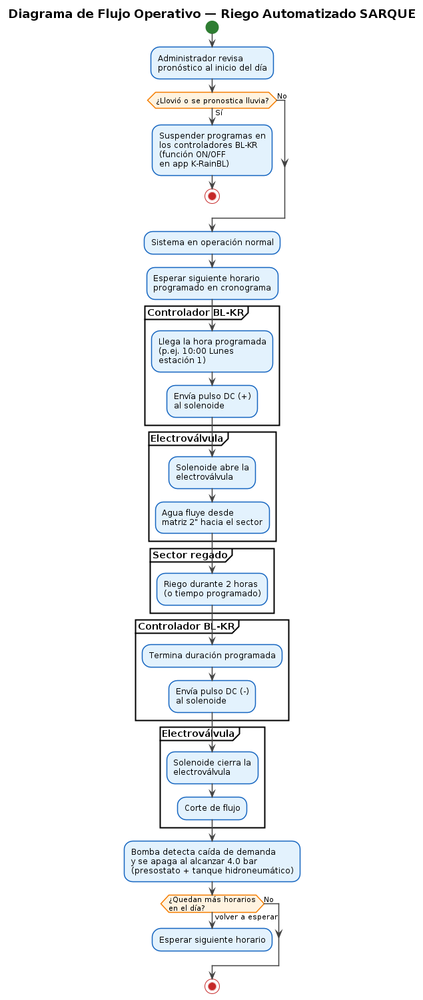
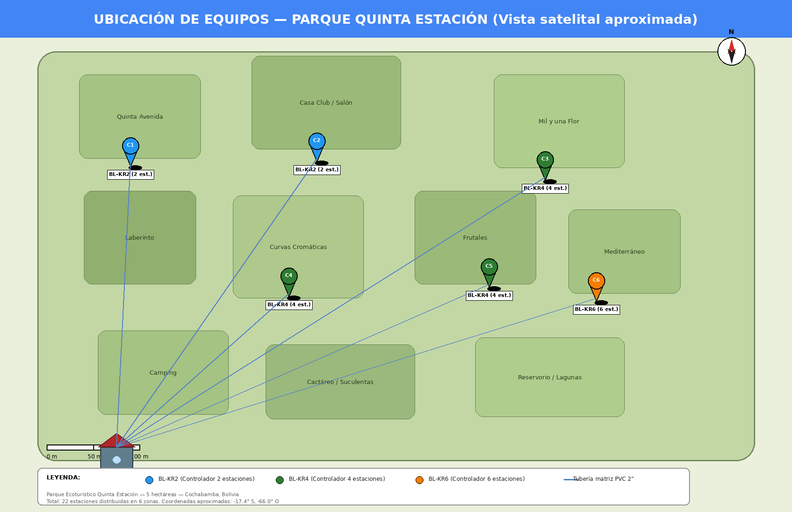

# INSTITUTO TECNOLÓGICO SUPERIOR DE SACABA
## CARRERA DE INFORMÁTICA INDUSTRIAL

---

# SISTEMA AUTOMATIZADO DE RIEGO CON ELECTROVÁLVULAS Y CONTROLADORES DE RIEGO (BL-KR) PARA LA GESTIÓN EFICIENTE DEL AGUA EN EL PARQUE ECOTURÍSTICO QUINTA ESTACIÓN

**(SARQUE)**

*Trabajo Dirigido para optar al Título de Técnico Superior en Informática Industrial*

**Postulante:**
Jose Neyer Arnez Aguilar

**Tutor:**
Ing. Ariel Luis Gruich Arratia

Cochabamba — Bolivia
2026

---

## ÍNDICE DE CONTENIDOS

- RESUMEN
- INTRODUCCIÓN
- CAPÍTULO I — DIAGNÓSTICO, JUSTIFICACIÓN, OBJETIVOS Y METODOLOGÍA
  - 1.1. Diagnóstico y Justificación
  - 1.2. Planteamiento y Formulación del Problema
  - 1.3. Objetivos: General y Específicos
  - 1.4. Enfoque Metodológico
- CAPÍTULO II — MARCO TEÓRICO Y CONCEPTUAL
  - 2.1. Métodos de Recolección de Información
  - 2.2. Ingeniería de Software
  - 2.3. Sistemas de Riego Automatizados
  - 2.4. Controladores Bluetooth K-Rain BL-KR
  - 2.5. Actuadores e Instrumentación Hidráulica
  - 2.6. Programación Frontend
  - 2.7. Plataforma Backend y Base de Datos
  - 2.8. Normativa
- CAPÍTULO III — PROPUESTA DE INNOVACIÓN
  - 3.1. Modelado de Negocio Actual y Alternativo
  - 3.2. Diseño e Implementación de la Plataforma Web SARQUE
  - 3.3. Diseño e Implementación del Sistema de Riego en Campo
  - 3.4. Funcionamiento del Software
  - 3.5. Configuración de los Equipos
  - 3.6. Conexión entre el Usuario y los Equipos
  - 3.7. Evidencia del Trabajo de Instalación en Campo
  - 3.8. Pruebas Realizadas
  - 3.9. Análisis de Resultados
- CAPÍTULO IV — CONCLUSIONES Y RECOMENDACIONES
- BIBLIOGRAFÍA
- ANEXO A — ESPECIFICACIONES TÉCNICAS DETALLADAS
- ANEXO B — GALERÍA FOTOGRÁFICA COMPLEMENTARIA

## ÍNDICE DE FIGURAS

- Figura 1. Diagrama de Casos de Uso de la Plataforma SARQUE
- Figura 2. Diagrama de Componentes de la Plataforma SARQUE
- Figura 3. Modelo Entidad-Relación de la Base de Datos SARQUE
- Figura 4. Arquitectura General del Sistema de Riego SARQUE
- Figura 5. Diagrama de Flujo Operativo del Riego Automatizado
- Figura 6. Ubicación de los Equipos Instalados en el Predio del Parque
- Figura 7. Excavación Manual de Zanjas para el Tendido del Politubo
- Figura 8. Electroválvula K-Rain BSPT 9V DC Instalada en Caja de Hormigón
- Figura 9. Empalmes Impermeabilizados del Cableado de Control
- Figura 10. Caseta de Bombeo con Tanque Hidroneumático y Manómetro

---

## RESUMEN

SARQUE es un sistema automatizado de riego implementado en el Parque Ecoturístico Quinta Estación de Cochabamba, Bolivia, un espacio verde de 5 hectáreas con más de 20 sectores de vegetación diferenciada. El sistema integra 6 controladores Bluetooth K-Rain BL-KR (2 BL-KR2, 3 BL-KR4 y 1 BL-KR6, totalizando 22 estaciones) con electroválvulas K-Rain BSPT de 9 V DC tipo latching, una bomba sumergible Grundfos de 5 HP con tanque hidroneumático y una red hidráulica de tuberías PVC de 2" y 1 ½". La programación de los controladores se realiza mediante la aplicación móvil oficial K-RainBL sobre conexión Bluetooth Low Energy (BLE), eliminando la necesidad de infraestructura WiFi en el predio. Como aporte académico complementario, se desarrolló una plataforma web en React, TypeScript y Supabase que centraliza el catálogo de sectores, los controladores y el cronograma semanal de riego, reemplazando el documento físico utilizado previamente. El trabajo se ejecutó bajo modalidad de Trabajo Dirigido, integrando los conceptos centrales de la Carrera de Informática Industrial del ITSa: automatización de procesos hidráulicos, instrumentación de actuadores, redes inalámbricas de corto alcance e ingeniería de software.

---

## INTRODUCCIÓN

El manejo eficiente del agua en espacios verdes de gran extensión constituye uno de los desafíos centrales para la gestión de parques ecoturísticos en Bolivia. La adopción de sistemas de automatización basados en controladores electrónicos y actuadores hidráulicos permite reducir el consumo hídrico, optimizar los tiempos del personal y garantizar que cada sector vegetal reciba el riego adecuado en el momento correcto.

El Parque Ecoturístico Quinta Estación, propiedad de la Sra. Eliana Soria Yapur, está ubicado en la ciudad de Cochabamba, Bolivia, y posee una superficie de 5 hectáreas con una diversidad de especies vegetales —árboles frutales, plantas ornamentales, laberintos de wisterias, zonas de suculentas, huertos orgánicos, lagunas y áreas de camping, entre otros— distribuidas en más de 20 sectores diferenciados, cada uno con requerimientos hídricos específicos y un calendario de riego semanal propio.

En la actualidad, el proceso de riego es ejecutado manualmente por 6 jardineros que deben recorrer las 5 hectáreas para abrir y cerrar las llaves de paso que alimentan cada sector desde la bomba sumergible Grundfos de 5 HP instalada en el pozo del parque. Este proceso implica un tiempo mínimo de 30 minutos diarios en desplazamientos, sin contar el tiempo efectivo de riego (aproximadamente 2 horas por sector), y presenta un riesgo operativo crítico documentado: el olvido de una llave de paso abierta provoca fugas en las cañerías o riego excesivo en sectores ya atendidos; el olvido de una llave cerrada implica que una zona no recibe riego en el día correspondiente, comprometiendo la salud de las especies vegetales.

El presente Trabajo Dirigido describe el diseño, instalación y puesta en marcha de SARQUE, un sistema que integra controladores de riego Bluetooth K-Rain BL-KR, electroválvulas K-Rain BSPT de 9 V DC tipo latching, una red hidráulica de tuberías PVC dimensionada al caudal de la bomba existente, y una plataforma web complementaria desarrollada en React + TypeScript con backend en Supabase para la documentación digital del sistema. Los controladores BL-KR se programan mediante la aplicación oficial K-RainBL del fabricante (disponible para iOS y Android), eliminando la necesidad de personal en campo durante los ciclos de riego programados.

El trabajo se desarrolló bajo la Metodología de Desarrollo Rápido de Aplicaciones (DRA) en su componente de software y bajo la metodología de Diseño Top-Down en su componente hidráulico-eléctrico, permitiendo iterar el sistema en fases cortas con retroalimentación directa de la administración del parque.

El documento está organizado en cuatro capítulos: el Capítulo I establece el diagnóstico situacional, la justificación, el planteamiento del problema, los objetivos y el enfoque metodológico. El Capítulo II desarrolla el marco teórico y conceptual que sustenta las decisiones técnicas adoptadas. El Capítulo III presenta la propuesta de innovación con el modelado de negocio, el diseño e implementación del sistema de riego en campo y de la plataforma web complementaria, las pruebas realizadas y el análisis de resultados. Finalmente, el Capítulo IV expone las conclusiones y recomendaciones derivadas del trabajo.

---

# CAPÍTULO I — DIAGNÓSTICO, JUSTIFICACIÓN, OBJETIVOS Y METODOLOGÍA

## 1.1. Diagnóstico y Justificación

### 1.1.1. Diagnóstico

#### 1.1.1.1. Antecedentes Generales

La automatización de sistemas de riego mediante controladores electrónicos y actuadores hidráulicos es un área activa de implementación a nivel mundial, impulsada por la necesidad de optimizar el uso del agua en espacios agrícolas y ornamentales ante la creciente escasez hídrica global.

Pérez et al. (2022) desarrollaron un sistema de riego automatizado para cultivos hortícolas en México utilizando controladores programables y electroválvulas solenoide. El sistema redujo el consumo de agua en un 34 % respecto al riego manual al permitir la programación precisa de duración y frecuencia por zona. (Pérez, Ramírez y Torres, 2022)

García y López (2023) implementaron un sistema de control de riego por zonas para un parque urbano en España, empleando controladores de riego programables y electroválvulas de acción latente. El estudio destacó que la programación por zonas horarias permite reducir el tiempo de trabajo del personal de mantenimiento entre un 40 % y un 60 %, al eliminar la necesidad de supervisión presencial durante los ciclos de riego. (García y López, 2023)

En el ámbito latinoamericano, Castillo (2021) documentó el diseño e implementación de un sistema de control de riego en jardines botánicos de Colombia, concluyendo que la automatización del riego en espacios verdes de más de 2 hectáreas requiere una arquitectura distribuida con múltiples controladores zonales que operen coordinadamente. (Castillo, 2021)

Estos antecedentes evidencian una tendencia global hacia la sustitución del riego manual por sistemas automatizados con capacidad de programación por zonas, especialmente en contextos donde la extensión del área verde supera la capacidad de supervisión presencial del personal disponible.

#### 1.1.1.2. Antecedentes Específicos

La búsqueda de antecedentes específicos orientada a sistemas automatizados de riego con controladores Bluetooth K-Rain BL-KR en Bolivia y en el ITSa Sacaba no arrojó proyectos documentados previamente. No se encontraron tesis, prototipos ni sistemas instalados en parques ecoturísticos de la región que aborden la integración de controladores BL-KR con electroválvulas BSPT para automatizar el riego de espacios de 5 hectáreas o más.

Este vacío confirma la originalidad del proyecto SARQUE en el contexto local y evidencia la necesidad de desarrollar una solución adaptada a las condiciones específicas del Parque Ecoturístico Quinta Estación: alimentación hídrica desde pozo propio con bomba sumergible Grundfos de 5 HP, distribución por gravedad con 41 puntos de riego históricos consolidados en 22 estaciones controladas, cobertura desigual de señal WiFi en el predio (lo que descarta soluciones cloud en tiempo real) y presupuesto limitado que excluye soluciones comerciales de telemetría industrial.

#### 1.1.1.3. Diagnóstico del Problema en el Parque

El Parque Ecoturístico Quinta Estación, propiedad de la Sra. Eliana Soria Yapur, está ubicado en la ciudad de Cochabamba, Bolivia, y cuenta con una superficie de 5 hectáreas distribuidas en más de 20 sectores de vegetación diferenciada, entre los que se incluyen: Quinta Avenida, Laberinto de Wisterias, Laguna Cuadrada, Laguna de Carpas, Mil y una Flor, Rotonda, Torre de Abajo, Reservorio de Agua, Curvas Cromáticas Norte, Curvas Cromáticas Chirimoyas, Huerto Orgánico, Cactáreo Izquierdo, Cactáreo Derecho, Paseo de Olivos, Jardín de Suculentas, Área Frutales, Mediterráneo, Jardín de Camping, entre otros.

El parque emplea a 6 jardineros y 1 administrador, bajo la dirección de la propietaria. El sistema de riego actual funciona mediante una bomba sumergible Grundfos de 5 HP trifásica instalada en un pozo de 50 metros de profundidad, con un caudal medido de 4 litros por segundo y un tanque hidroneumático que opera entre 3.5 y 4.0 bar. La bomba es capaz de mantener activa una sola zona de riego a la vez. El agua se distribuye desde la matriz principal de 2" en PVC a través de cuelleras de 1 ½" hacia 41 puntos de riego históricos distribuidos en el predio —representados en el Plano General a escala 1:250 como puntos de color dorado—, cada uno de los cuales debía ser abierto y cerrado manualmente por el personal en cada ciclo de riego.

El cronograma de riego semanal es de alta complejidad: asigna entre 3 y 6 sectores por día, con turnos de 2 horas por sector distribuidos en franjas horarias de 8:00 a 20:00, variando los sectores asignados según el día de la semana. Este cronograma se mantenía únicamente en un documento de papel que requería que el jardinero de turno recordara qué sectores corresponden a cada día, a qué hora debe abrir cada llave y a qué hora debe cerrarla.

Mediante observación directa en el parque y entrevista no estructurada a la administración, se identificaron los siguientes problemas:

**a) Tiempo improductivo por desplazamientos.** El jardinero debe recorrer físicamente las 5 hectáreas del parque para llegar a cada llave de paso. El tiempo mínimo invertido en desplazamientos es de 30 minutos diarios, sin contar el tiempo de riego efectivo. En un parque de esta extensión, la distancia entre la zona de trabajo habitual del jardinero y la llave de paso correspondiente puede superar los 300 metros.

**b) Fugas por olvido de cierre de llave.** El problema operativo más crítico identificado es el olvido de cierre de una llave de paso al finalizar el turno de riego. Al existir una sola bomba activa, cuando una llave queda abierta fuera de su horario, la presión de la red provoca fugas en las cañerías o inundación del sector, dañando las plantas por exceso de agua y desperdiciando el recurso hídrico del pozo.

**c) Mal riego por olvido de apertura de llave.** De forma inversa, el olvido de apertura de una llave en el horario asignado implica que el sector correspondiente no recibe riego en esa jornada. Dado que algunos sectores solo se riegan 1 o 2 veces por semana según el cronograma, un olvido puede comprometer la salud de las especies vegetales de ese sector durante varios días.

**d) Cronograma en papel sin respaldo digital.** El cronograma semanal de riego se encuentra únicamente en un documento físico que puede dañarse, perderse o desactualizarse sin que el resto del personal tenga acceso a la versión vigente. No existe documentación digital centralizada del sistema hídrico ni de la asignación de sectores por jardinero.

**e) Imposibilidad de gestión centralizada.** La administración no dispone de una herramienta digital que permita visualizar el sistema completo, planificar modificaciones al cronograma, registrar la composición vegetal de cada sector ni delegar la consulta del cronograma al personal de campo desde dispositivos móviles.

#### 1.1.1.4. Justificación

**Justificación operativa.** Un olvido de apertura o cierre de llave de paso puede ocurrir en cualquiera de los 41 puntos del parque. Con 6 sectores diarios a gestionar en promedio, la probabilidad de error manual en un sistema completamente dependiente de la memoria humana es estadísticamente significativa. SARQUE reemplaza la decisión manual por una programación automática en los 6 controladores K-Rain BL-KR, garantizando que cada electroválvula se abra y cierre en el horario exacto configurado en la app K-RainBL, independientemente de la presencia o atención del jardinero.

**Justificación hídrica.** La bomba sumergible Grundfos de 5 HP extrae agua de un pozo propio a un caudal de 4 L/s. Una llave de paso olvidada abierta durante 2 horas fuera de su horario desperdicia aproximadamente 28.800 litros de agua (4 L/s × 7.200 s). SARQUE elimina este riesgo al automatizar el cierre de electroválvulas al término exacto del ciclo programado en el controlador BL-KR.

**Justificación laboral.** Con 30 minutos diarios de desplazamiento mínimo para el manejo de llaves, el personal invierte aproximadamente 182 horas anuales exclusivamente en caminatas de apertura y cierre de llaves. SARQUE libera ese tiempo para tareas de mayor valor: poda, abono, mantenimiento de instalaciones y atención a visitantes del parque.

**Justificación de gestión.** La plataforma web SARQUE reemplaza el cronograma semanal en papel —vulnerable a pérdida, deterioro y desactualización— por una versión digital centralizada accesible desde cualquier dispositivo con acceso a internet, permitiendo a la administración modificar el cronograma, registrar nuevos sectores y mantener actualizada la documentación del sistema hídrico.

**Justificación tecnológica.** El proyecto integra y aplica conceptos centrales de la Carrera de Informática Industrial del ITSa Sacaba: automatización de procesos hidráulicos con controladores Bluetooth, actuadores electromecánicos de acción latente, redes hidráulicas con bombas centrífugas y tanques hidroneumáticos, bases de datos relacionales en la nube, API REST, interfaces web responsivas y validación de datos. La solución es replicable en cualquier espacio verde de la región con condiciones similares y costo total accesible al sector privado boliviano.

---

## 1.2. Planteamiento y Formulación del Problema Técnico-Tecnológico

### 1.2.1. Identificación del Problema

A continuación se presenta el análisis de causa raíz aplicando el método de los 5 Porqués, que permite profundizar progresivamente en las causas del problema central identificado en el parque.

**Tabla 1. Análisis de Causa Raíz — Método de los 5 Porqués**

| N° | Pregunta | Respuesta |
|----|----------|-----------|
| 1 | ¿Por qué se producen fugas y mal riego en el parque? | Porque las llaves de paso se olvidan abiertas o cerradas |
| 2 | ¿Por qué se olvidan las llaves de paso? | Porque el control es 100 % manual y depende de la memoria del jardinero |
| 3 | ¿Por qué el control es manual? | Porque no existe un sistema de automatización para los 41 puntos del parque |
| 4 | ¿Por qué no existe automatización? | Porque no se ha implementado ningún sistema de control electrónico para el riego |
| 5 | ¿Por qué no se ha implementado? | Porque no existe un proyecto técnico adaptado a las condiciones del parque (5 ha, pozo, BLE, sin WiFi completo) |

*Fuente: Elaboración propia, 2026.*
**Árbol de Problemas:**

- **Causa raíz:** Control de riego manual con 41 llaves de paso distribuidas en 5 hectáreas y cronograma en papel
- **Problema central:** Gestión ineficiente del agua en el Parque Ecoturístico Quinta Estación
- **Efectos:**
  - Fugas en cañerías por llaves olvidadas abiertas
  - Sectores sin riego por llaves olvidadas cerradas
  - Tiempo improductivo del personal en desplazamientos
  - Cronograma en papel vulnerable a pérdida o desactualización
  - Daño potencial a especies vegetales por déficit o exceso hídrico

### 1.2.2. Formulación del Problema

¿De qué manera la implementación de un sistema automatizado de riego con electroválvulas y controladores de riego K-Rain BL-KR programables mediante app móvil, complementado con una plataforma web de documentación digital, contribuye a la gestión eficiente del agua en el Parque Ecoturístico Quinta Estación?

---

## 1.3. Objetivos: General y Específicos

### 1.3.1. Objetivo General

Diseñar e implementar un sistema de riego automatizado para el Parque Ecoturístico Quinta Estación de Cochabamba, Bolivia.

### 1.3.2. Objetivos Específicos

1. **Diagnosticar** la situación actual del sistema de riego manual del Parque Ecoturístico Quinta Estación, identificando los sectores de riego, el cronograma semanal vigente, el caudal disponible de la bomba sumergible Grundfos de 5 HP y los problemas operativos documentados.

2. **Diseñar** la arquitectura del sistema SARQUE, definiendo la consolidación de los 41 puntos de riego originales en 22 estaciones controladas distribuidas en 6 controladores K-Rain BL-KR (2 BL-KR2, 3 BL-KR4 y 1 BL-KR6), optimizando el tendido del cable monofilar 20 AWG para que ningún solenoide quede a más de 30 metros del controlador correspondiente.

3. **Instalar** la infraestructura hidráulica y eléctrica del sistema en el predio del parque: red de tuberías PVC de 2" (matriz) y 1 ½" (cuelleras), excavación de zanjas a 20-25 cm de profundidad para el politubo de 3/4" que aloja el cable, montaje de electroválvulas K-Rain BSPT de 9 V DC tipo latching en cajas de hormigón de 40 × 40 × 30 cm y cableado de los solenoides hasta los controladores.

4. **Programar** los 6 controladores K-Rain BL-KR mediante la aplicación oficial K-RainBL del fabricante para reproducir el cronograma semanal de riego del parque, asignando a cada estación los días, horas y duración correspondientes.

5. **Desarrollar** la plataforma web SARQUE en React + TypeScript con backend en Supabase, incluyendo módulos de autenticación, catálogo digital de sectores, catálogo de controladores BL-KR y sus estaciones asignadas, planificador visual del cronograma semanal y manual de usuario integrado.

6. **Validar** el sistema completo mediante pruebas en campo del cronograma automatizado en al menos un controlador instalado y pruebas funcionales de la plataforma web con la administración del parque.

---

## 1.4. Enfoque Metodológico

El proyecto se desarrolló combinando dos metodologías complementarias:

**Metodología de Desarrollo Rápido de Aplicaciones (DRA / RAD)** para el componente de software (plataforma web SARQUE), seleccionada por su capacidad de entregar prototipos funcionales en ciclos cortos con retroalimentación directa del usuario final.

**Metodología de Diseño Top-Down** para el componente hidráulico-eléctrico (sistema de riego en campo), que parte de la definición del sistema en su nivel más alto (las 5 hectáreas a regar) y lo descompone progresivamente en zonas, sectores, estaciones y componentes individuales.

La siguiente tabla resume las cuatro fases metodológicas del Desarrollo Rápido de Aplicaciones (DRA) y su aplicación específica al proyecto SARQUE, indicando la duración estimada de cada fase.

**Tabla 2. Matriz Metodológica**

| Fase | Actividad en SARQUE | Duración estimada |
|------|--------------------|--------------------|
| Diagnóstico | Entrevista y observación directa en el parque; relevamiento del plano hídrico; documentación del cronograma | 2 semanas |
| Diseño | Consolidación de los 41 puntos en 22 estaciones; selección de controladores; diseño de la app web | 2 semanas |
| Adquisición | Compra de controladores BL-KR, electroválvulas K-Rain BSPT, cable 20 AWG y materiales hidráulicos | 1 semana |
| Instalación en campo | Excavación de zanjas, montaje de cajas de hormigón, instalación de electroválvulas, tendido de cableado | 4 semanas |
| Programación de controladores | Configuración de los 6 controladores BL-KR vía app K-RainBL con el cronograma definido | 1 semana |
| Desarrollo web | Implementación de la plataforma SARQUE: auth, catálogo, planificador | 4 semanas |
| Pruebas y ajustes | Validación del sistema en campo y pruebas funcionales de la web | 1 semana |

*Fuente: Elaboración propia, 2026.*
### 1.4.1. Alcance Temporal

El cronograma de actividades detalla las 16 semanas de ejecución del proyecto, distribuidas en las fases de diagnóstico, diseño, adquisición, instalación física y desarrollo de software.

**Tabla 3. Cronograma de Actividades — SARQUE**

| Semana | Actividad |
|--------|-----------|
| 1–2 | Diagnóstico situacional; entrevista a administración del parque; relevamiento del plano hídrico |
| 3–4 | Diseño de arquitectura del sistema; selección de componentes; cálculo de cargas hidráulicas |
| 5 | Adquisición de hardware (controladores, electroválvulas, cable, tubería, cajas) |
| 6–9 | Instalación en campo: excavación, tendido de cañerías, montaje de electroválvulas |
| 10 | Programación de los 6 controladores BL-KR con la app K-RainBL |
| 11–14 | Desarrollo de la plataforma web SARQUE |
| 15 | Pruebas funcionales y de aceptación; ajustes finales |
| 16 | Redacción del informe final; preparación de la defensa |

*Fuente: Elaboración propia, 2026.*
---

# CAPÍTULO II — MARCO TEÓRICO Y CONCEPTUAL

## 2.1. Métodos de Recolección de Información

### 2.1.1. Entrevista No Estructurada

La entrevista no estructurada es una técnica de recolección de información cualitativa en la que el entrevistador conduce la conversación sin seguir un cuestionario predefinido, permitiendo que el entrevistado exprese libremente su experiencia y conocimiento sobre el tema de estudio. Esta flexibilidad facilita la identificación de problemas no anticipados y la profundización en aspectos relevantes que emergen naturalmente durante la conversación (Hernández Sampieri, 2018).

En el proyecto SARQUE, se realizaron entrevistas no estructuradas a la administración del Parque Ecoturístico Quinta Estación y a los 6 jardineros responsables del riego, permitiendo identificar los problemas operativos del riego manual, cuantificar el tiempo invertido en desplazamientos y documentar los incidentes más frecuentes relacionados con el manejo de las llaves de paso.

### 2.1.2. Observación Directa

La observación directa consiste en el registro sistemático de fenómenos, comportamientos y procesos tal como ocurren en su contexto natural, sin intervención del investigador. Es especialmente valiosa para documentar procesos operativos que los informantes no describen con precisión en las entrevistas porque los consideran obvios o rutinarios (Yin, 2018).

En SARQUE, la observación directa se realizó durante las jornadas de riego del parque, registrando los recorridos del personal, los tiempos de desplazamiento entre sectores, el procedimiento de apertura y cierre de llaves de paso y los incidentes de olvido en el manejo del cronograma.

---

## 2.2. Ingeniería de Software

### 2.2.1. Desarrollo Rápido de Aplicaciones (DRA / RAD)

El Desarrollo Rápido de Aplicaciones (DRA) es una metodología de desarrollo de software propuesta por James Martin en 1991, orientada a la entrega iterativa de prototipos funcionales en ciclos cortos. El modelo DRA comprende cuatro fases: Planificación de Requisitos, Diseño del Usuario, Construcción y Transición. (Martin, 1991)

### 2.2.2. Lenguaje Unificado de Modelado (UML)

El Lenguaje Unificado de Modelado (UML) es un estándar de la industria para la representación gráfica de sistemas de software. Proporciona un conjunto de notaciones y diagramas para modelar la estructura, el comportamiento y la interacción de los componentes de un sistema. (Booch, Rumbaugh y Jacobson, 2005)

### 2.2.3. Diagrama de Componentes

El diagrama de componentes UML representa la estructura física del sistema de software, mostrando los componentes (módulos, paquetes, librerías) y sus dependencias.

### 2.2.4. Diagrama de Casos de Uso

El diagrama de casos de uso UML describe las interacciones entre los actores del sistema (usuarios, dispositivos externos) y las funcionalidades que el sistema provee.

### 2.2.5. Diagrama de Flujo

El diagrama de flujo representa gráficamente la secuencia de pasos de un proceso o algoritmo mediante símbolos estandarizados (rectángulos para procesos, rombos para decisiones, óvalos para inicio y fin). En SARQUE se utiliza para representar el flujo operativo del riego automatizado.

---

## 2.3. Sistemas de Riego Automatizados

### 2.3.1. Riego por Estaciones

Un sistema de riego por estaciones divide el área a regar en zonas o "estaciones" independientes, cada una controlada por una electroválvula propia. Un controlador central activa secuencialmente las electroválvulas según un cronograma programado, permitiendo regar una zona a la vez con la totalidad del caudal disponible de la bomba. Esta arquitectura es la estándar en sistemas de riego residenciales, parques y campos agrícolas pequeños y medianos. (Pizarro, 2017)

### 2.3.2. Bomba Sumergible Centrífuga

Una bomba sumergible centrífuga es un equipo electromecánico instalado bajo el nivel del agua del pozo, que utiliza la fuerza centrífuga generada por un rotor (impulsor) para elevar el agua hasta la superficie. Sus ventajas frente a las bombas de superficie son la ausencia de problemas de cebado, mayor eficiencia y menor ruido. La bomba Grundfos de 5 HP utilizada en el parque es trifásica y se ubica a 50 metros de profundidad en el pozo. (Karassik, 2008)

### 2.3.3. Tanque Hidroneumático

Un tanque hidroneumático es un recipiente cerrado parcialmente lleno de aire comprimido que actúa como reserva de presión hidráulica. Permite que la bomba no se encienda con cada apertura puntual de una válvula, sino que mantenga la red presurizada entre 3.5 y 4.0 bar mediante el aire comprimido. Cuando la presión cae por debajo del umbral inferior por consumo, un presostato activa la bomba; cuando supera el umbral superior, la apaga. Esto extiende la vida útil de la bomba y estabiliza el caudal hacia las electroválvulas. (Karassik, 2008)

### 2.3.4. Cálculo de Volumen de Riego

El volumen de agua entregado en un ciclo de riego puede calcularse mediante la fórmula:

> **V = Q × t**

Donde V es el volumen en litros, Q es el caudal en L/s y t es la duración en segundos. En SARQUE, con Q = 4 L/s, un ciclo de riego de 2 horas (7.200 s) entrega 28.800 L por sector activo.

---

## 2.4. Controladores Bluetooth K-Rain BL-KR

### 2.4.1. La Línea K-Rain BL-KR

La línea K-Rain BL-KR es una familia de controladores de riego a batería (9 V DC) con conectividad Bluetooth Smart (BLE 4.0) fabricados por K-Rain Manufacturing Corporation (Florida, EE.UU.). Los controladores de la línea BL-KR se programan exclusivamente mediante la aplicación móvil K-RainBL (disponible para iOS y Android) y activan electroválvulas de 9 V DC de acción latente (latching solenoids) mediante pulsos de corriente de polaridad positiva (apertura) y negativa (cierre). La familia comprende los modelos BL-KR1 (1 estación), BL-KR2 (2 estaciones), BL-KR4 (4 estaciones), BL-KR6 (6 estaciones) y BL-KR9 (9 estaciones). (K-Rain Manufacturing Corporation, 2020)

En SARQUE se utilizan 6 controladores BL-KR distribuidos en el parque, seleccionados de modo que el cable monofilar 20 AWG entre cada controlador y su electroválvula más lejana no supere los 30 metros (optimización de cableado y caída de tensión):

- **2 unidades BL-KR2** (2 estaciones cada una): 4 estaciones
- **3 unidades BL-KR4** (4 estaciones cada una): 12 estaciones
- **1 unidad BL-KR6** (6 estaciones): 6 estaciones
- **Total: 22 estaciones de riego automatizadas**

### 2.4.2. Bluetooth Low Energy (BLE)

Bluetooth Low Energy (BLE), también conocido como Bluetooth Smart, es una especificación de comunicación inalámbrica de corto alcance introducida en la versión 4.0 del estándar Bluetooth (2010). A diferencia del Bluetooth clásico, BLE está optimizado para dispositivos que requieren bajo consumo energético y comunicación en ráfagas cortas, lo que lo hace idóneo para dispositivos alimentados por baterías como los controladores K-Rain BL-KR. El alcance típico de BLE es de 10 a 30 metros en condiciones de campo abierto. (Bluetooth SIG, 2016)

### 2.4.3. Aplicación K-RainBL

K-RainBL es la aplicación móvil oficial de K-Rain Manufacturing Corporation para iOS y Android, utilizada exclusivamente para la programación y operación de los controladores BL-KR. La aplicación permite:

- Emparejar dispositivos mediante BLE
- Asignar nombres y claves de seguridad a cada controlador
- Programar hasta 3 programas (A, B y C) por controlador
- Definir días de riego (personalizado, pares, impares, intervalos)
- Configurar tiempos de inicio y duración por estación
- Aplicar un "presupuesto de agua" estacional (porcentaje de ajuste)
- Suspender/reanudar el sistema (ON/OFF)
- Ejecutar pruebas manuales por estación
- Configurar un sensor de lluvia normalmente cerrado

La programación se transmite al controlador mediante el botón **Save** seguido de **Transmit**, y el controlador confirma la recepción con un tono "bing".

---

## 2.5. Actuadores e Instrumentación Hidráulica

### 2.5.1. Electroválvula K-Rain BSPT 9V DC Latching

Una electroválvula (o válvula solenoide) es un actuador electromecánico que controla el paso de fluidos mediante la activación o desactivación de un solenoide eléctrico. Las electroválvulas de tipo **latching** (de retención) utilizan un imán permanente para mantener la posición abierta o cerrada sin consumo continuo de corriente, requiriendo únicamente un pulso de energía para cambiar de estado. Esta característica las hace ideales para controladores alimentados por batería como los K-Rain BL-KR. Las electroválvulas K-Rain BSPT operan a 9 V DC y son compatibles con todos los controladores de la línea BL-KR. La conexión BSPT (British Standard Pipe Taper) es el estándar de rosca de tubería utilizado en Bolivia y en el mercado latinoamericano para conexiones hidráulicas de baja y media presión. (K-Rain Manufacturing Corporation, 2020)

En SARQUE, las 22 electroválvulas K-Rain BSPT reemplazan los puntos críticos de la red original de 41 llaves de paso manuales, siendo actuadas por los 6 controladores BL-KR según el cronograma de riego programado en la app K-RainBL.

### 2.5.2. Cable Monofilar 20 AWG

El cable utilizado para conectar los solenoides de las electroválvulas a los controladores es de calibre **20 AWG (American Wire Gauge) monofilar**, con un solo conductor por solenoide más un retorno común. Su sección transversal de aproximadamente 0.518 mm² es adecuada para los pulsos de corriente de baja intensidad que activan los solenoides latching, en distancias de hasta 30 metros por estación sin caída de tensión significativa. El cable se aloja en politubo negro de polietileno de 3/4" de diámetro como protección mecánica y dieléctrica.

### 2.5.3. Caja de Válvula

La caja de válvula es el recinto que aloja la electroválvula, sus empalmes eléctricos y la llave de paso manual de respaldo. En SARQUE se utilizan cajas de hormigón armado de **40 × 40 × 30 cm**, fabricadas in situ, con tapa removible para facilitar el mantenimiento. Las dimensiones permiten acceder cómodamente al cuerpo de la electroválvula y a los empalmes del cable durante inspecciones o reparaciones.

---

## 2.6. Programación Frontend

### 2.6.1. React y TypeScript

React es una biblioteca de JavaScript para la construcción de interfaces de usuario basada en componentes, desarrollada y mantenida por Meta. Utiliza un modelo de renderizado declarativo basado en un Virtual DOM que optimiza las actualizaciones. TypeScript es un superconjunto de JavaScript con tipado estático, que mejora la detección de errores en tiempo de desarrollo y facilita el mantenimiento. La combinación React + TypeScript es el estándar para el desarrollo de aplicaciones web modernas. (Chinnathambi, 2023)

### 2.6.2. Vite

Vite es una herramienta de construcción y servidor de desarrollo para aplicaciones web modernas. Utiliza módulos ES nativos del navegador durante el desarrollo, lo que resulta en tiempos de arranque y recarga en caliente (HMR) significativamente menores que los de empacadores tradicionales. (You, 2021)

### 2.6.3. Tailwind CSS y shadcn/ui

Tailwind CSS es un framework de CSS utilitario que proporciona clases de bajo nivel aplicables directamente en el HTML. shadcn/ui es una colección de componentes React accesibles y personalizables, construidos sobre Radix UI y estilizados con Tailwind CSS, distribuidos como código fuente copiable al proyecto. (Shadcn, 2023)

### 2.6.4. React Query (TanStack Query)

React Query es una biblioteca de gestión de estado asíncrono para React que simplifica el manejo de datos del servidor: fetching, caching, sincronización y actualización de datos remotos mediante los hooks `useQuery` y `useMutation`. (Tanner Linsley, 2020)

---

## 2.7. Plataforma Backend y Base de Datos

### 2.7.1. Supabase

Supabase es una plataforma de backend como servicio (BaaS) de código abierto que provee una base de datos PostgreSQL, autenticación de usuarios, almacenamiento de archivos y API REST autogenerada a partir del esquema. Supabase es la alternativa de código abierto a Firebase y es adecuada para proyectos que requieren un backend funcional sin la complejidad de administrar infraestructura de servidores. (Copple y Wilson, 2020)

En SARQUE, Supabase provee: autenticación de usuarios con JWT, base de datos PostgreSQL con Row Level Security (RLS) y API REST para lectura y escritura desde la plataforma web.

### 2.7.2. PostgreSQL y Row Level Security (RLS)

PostgreSQL es un sistema de gestión de bases de datos relacionales de código abierto, reconocido por su robustez y cumplimiento de los estándares SQL. Row Level Security (RLS) permite definir políticas de acceso a nivel de fila, de modo que los usuarios solo pueden leer o modificar las filas para las que tienen permisos explícitos. En SARQUE, RLS garantiza que solo usuarios autenticados con el rol correspondiente puedan modificar el catálogo de sectores o el cronograma de riego. (PostgreSQL Global Development Group, 2024)

### 2.7.3. Zod

Zod es una biblioteca de validación de esquemas para TypeScript que permite definir la forma y las restricciones de los datos en tiempo de compilación y ejecución. En SARQUE, Zod valida los datos de entrada en los formularios web antes de enviarlos a Supabase. (Colinhacks, 2021)

---

## 2.8. Normativa

### 2.8.1. Norma Boliviana NB 777 — Instalaciones Eléctricas en Interiores

La Norma Boliviana NB 777 establece los requisitos técnicos mínimos para el diseño, instalación y verificación de instalaciones eléctricas en interiores en Bolivia, en concordancia con las normas internacionales IEC 60364. (IBNORCA, 2004)

En SARQUE, la NB 777 se aplicó en el diseño de la alimentación eléctrica trifásica de la bomba sumergible Grundfos y en la protección del cableado de control de los controladores BL-KR.

---

# CAPÍTULO III — PROPUESTA DE INNOVACIÓN

## 3.1. Modelado de Negocio Actual y Alternativo

### 3.1.1. Modelado de Negocio Actual

El proceso de riego actual en el Parque Quinta Estación sigue el siguiente flujo operativo:

1. Al inicio de la jornada, el administrador verifica si llovió. Si llovió, suspende el riego del día.
2. El jardinero consulta el cronograma semanal (documento físico) para determinar qué sectores corresponden regar.
3. El jardinero se desplaza a pie hasta la primera llave de paso asignada (recorrido mínimo: 5 minutos).
4. El jardinero abre manualmente la llave de paso.
5. El jardinero realiza otras tareas durante las 2 horas que dura el riego.
6. Al cumplirse el tiempo, el jardinero debe regresar a la llave y cerrarla manualmente.
7. El proceso se repite para cada sector del día (3 a 6 sectores).
8. No se genera ningún registro del riego realizado.

Esta tabla identifica los cinco problemas operativos principales detectados en el sistema de riego manual actual del parque, clasificados por frecuencia e impacto.

**Tabla 4. Problemas identificados en el proceso actual**

| ID | Problema | Frecuencia | Impacto |
|----|----------|-----------|---------|
| P01 | Olvido de cierre de llave de paso → fuga/inundación | Ocasional | Alto |
| P02 | Olvido de apertura de llave → sector sin riego | Ocasional | Alto |
| P03 | Tiempo improductivo en desplazamientos | Diario | Medio |
| P04 | Cronograma en papel vulnerable | Permanente | Medio |
| P05 | Ausencia de documentación digital del sistema | Permanente | Medio |

*Fuente: Elaboración propia, 2026.*
### 3.1.2. Modelado de Negocio Alternativo

Con SARQUE, el proceso de riego pasa a operar de la siguiente manera:

1. Al inicio de la jornada, el administrador revisa el pronóstico del tiempo. Si llovió, suspende el sistema completo desde la app K-RainBL en cada controlador (función ON/OFF) o desactiva las electroválvulas implicadas.
2. Los 6 controladores BL-KR ejecutan automáticamente el cronograma de riego programado en la app K-RainBL: abren y cierran las electroválvulas en los horarios exactos definidos.
3. Durante las jornadas, el personal puede consultar el cronograma vigente, los sectores asignados, los controladores y las estaciones desde la plataforma web SARQUE en cualquier dispositivo con internet.
4. Cualquier modificación del cronograma se documenta en SARQUE y se replica manualmente en los controladores BL-KR mediante la app K-RainBL.

La tabla muestra la correspondencia entre cada problema identificado en el sistema actual y la solución específica que aporta SARQUE para resolverlo.

**Tabla 5. Mejoras introducidas por SARQUE**

| Problema anterior | Solución SARQUE |
|-------------------|-----------------|
| Olvido de cierre de llave | Cierre automático al término del tiempo programado en el BL-KR |
| Olvido de apertura de llave | Apertura automática según cronograma programado |
| Tiempo en desplazamientos | Eliminado para el control de electroválvulas |
| Cronograma en papel | Cronograma digital centralizado en la plataforma web |
| Sin documentación del sistema | Catálogo digital de sectores, controladores y estaciones |

*Fuente: Elaboración propia, 2026.*
### 3.1.3. Análisis de Requerimientos

Los nueve requerimientos funcionales del sistema SARQUE se presentan agrupados por módulo, indicando qué debe hacer el sistema desde la perspectiva del usuario.

**Tabla 6. Requerimientos Funcionales**

| ID | Requerimiento | Módulo |
|----|--------------|--------|
| RF01 | El sistema debe permitir crear, editar y eliminar sectores del parque | Web — Sectores |
| RF02 | El sistema debe permitir registrar los 6 controladores BL-KR y sus estaciones asignadas | Web — Controladores |
| RF03 | El sistema debe permitir definir programas de riego con hora, minuto, duración y días de la semana por sector | Web — Horarios |
| RF04 | El sistema debe presentar el cronograma semanal en formato visual de calendario | Web — Cronograma |
| RF05 | El sistema debe requerir autenticación de usuario para acceder a cualquier módulo | Web — Auth |
| RF06 | El sistema debe diferenciar entre rol administrador (gestión completa) y operador (solo lectura) | Web — Auth/Roles |
| RF07 | El sistema debe validar todos los formularios de entrada con esquemas Zod | Web — Validación |
| RF08 | Los 6 controladores BL-KR deben ser programados desde la app K-RainBL siguiendo el cronograma de SARQUE | Campo — BL-KR |
| RF09 | Las 22 electroválvulas K-Rain BSPT deben abrir y cerrar correctamente al recibir pulsos del controlador | Campo — Electroválvulas |

*Fuente: Elaboración propia, 2026.*
Los seis requerimientos no funcionales describen las cualidades técnicas que el sistema debe cumplir en términos de rendimiento, usabilidad, normativa y robustez.

**Tabla 7. Requerimientos No Funcionales**

| ID | Requerimiento | Categoría |
|----|--------------|-----------|
| RNF01 | La plataforma web debe ser responsiva (móvil, tablet, escritorio) | Usabilidad |
| RNF02 | La latencia de carga de cualquier vista no debe superar los 3 segundos | Rendimiento |
| RNF03 | La base de datos debe mantener los datos disponibles por al menos 12 meses | Disponibilidad |
| RNF04 | El cable 20 AWG no debe presentar caída de tensión que impida la activación del solenoide | Confiabilidad |
| RNF05 | Las cajas de hormigón y empalmes impermeabilizados deben proteger los componentes ante lluvia | Robustez |
| RNF06 | La instalación eléctrica del sistema debe cumplir con la NB 777 | Normativa |

*Fuente: Elaboración propia, 2026.*
---

## 3.2. Diseño e Implementación de la Plataforma Web SARQUE

### 3.2.1. Identificación y Descripción de los Actores

La siguiente tabla describe los cuatro actores que interactúan con el sistema SARQUE, su rol específico y las funciones que cada uno realiza.

**Tabla 8. Actores del Sistema SARQUE**

| Actor | Descripción | Rol en el sistema |
|-------|-------------|-------------------|
| Administrador | Propietaria (Sra. Eliana Soria Yapur) y administrador del parque | Gestión completa: sectores, controladores, cronograma, usuarios |
| Operador | Jardinero con acceso a la plataforma | Visualización del cronograma y catálogo de sectores |
| Controlador BL-KR | Controlador K-Rain programado por la app K-RainBL | Activación de electroválvulas según programación local |
| App K-RainBL | Aplicación móvil oficial K-Rain | Programación BLE de los controladores |

*Fuente: Elaboración propia, 2026.*
### 3.2.2. Diagramas de Casos de Uso

**Figura 1. Diagrama de Casos de Uso de la Plataforma SARQUE**

*Fuente: Elaboración propia, 2026.*

Se presentan los siete casos de uso principales del sistema SARQUE, indicando el actor responsable y una descripción breve de cada uno.

**Tabla 9. Descripción de Casos de Uso**

| ID | Caso de Uso | Actor | Descripción |
|----|------------|-------|-------------|
| CU01 | Iniciar sesión | Admin / Operador | Autenticación con email y contraseña mediante Supabase Auth |
| CU02 | Ver cronograma semanal | Admin / Operador | Visualizar la tabla colorida del cronograma por día y franja horaria |
| CU03 | Gestionar sectores | Admin | Crear, editar y eliminar sectores del parque |
| CU04 | Gestionar controladores | Admin | Registrar los 6 controladores BL-KR y sus estaciones |
| CU05 | Definir horario de riego | Admin | Asignar hora, duración y días a cada estación |
| CU06 | Activar/desactivar horario | Admin | Suspender un horario sin eliminarlo (ej. invierno) |
| CU07 | Consultar manual de usuario | Admin / Operador | Acceder a la documentación integrada en la plataforma |

*Fuente: Elaboración propia, 2026.*
### 3.2.3. Diagrama de Componentes del Sistema

**Figura 2. Diagrama de Componentes de la Plataforma SARQUE**

*Fuente: Elaboración propia, 2026.*

La tabla detalla los siete componentes del sistema, la tecnología utilizada para implementarlos y la función específica que cumplen.

**Tabla 10. Descripción de Componentes SARQUE**

| Componente | Tecnología | Función |
|------------|-----------|---------|
| App Web | React + TypeScript + Vite | Interfaz de usuario: catálogo, cronograma, planificador |
| Supabase Auth | Supabase / JWT | Autenticación y gestión de sesiones |
| Supabase Database | PostgreSQL + RLS | Persistencia de datos: sectores, controladores, horarios |
| Controladores BL-KR | K-Rain BL-KR (BLE) | Activación de electroválvulas según cronograma local |
| Electroválvulas | K-Rain BSPT 9V DC | Actuadores hídricos en las 22 estaciones |
| App K-RainBL | App móvil oficial K-Rain | Programación BLE de los controladores |

*Fuente: Elaboración propia, 2026.*
### 3.2.4. Diseño de la Base de Datos

**Figura 3. Modelo Entidad-Relación de la Base de Datos SARQUE**

*Fuente: Elaboración propia, 2026.*

La base de datos de SARQUE en Supabase/PostgreSQL comprende las siguientes tablas:

Especificación de los campos de la entidad sectores, que almacena el catálogo de zonas de riego del parque.

**Tabla 11. Entidad `sectores`**

| Campo | Tipo | Descripción |
|-------|------|-------------|
| id | UUID (PK) | Identificador único del sector |
| nombre | TEXT | Nombre del sector (ej. "Laberinto de Wisterias") |
| descripcion | TEXT | Descripción de la vegetación |
| controlador_id | UUID (FK) | Referencia al controlador BL-KR asignado |
| numero_estacion | INTEGER | Número de estación dentro del controlador |
| activo | BOOLEAN | Estado habilitado/deshabilitado |
| created_at | TIMESTAMPTZ | Fecha de creación |

*Fuente: Elaboración propia, 2026.*
Especificación de los campos de la entidad controladores, que registra los 6 dispositivos K-Rain BL-KR del sistema.

**Tabla 12. Entidad `controladores`**

| Campo | Tipo | Descripción |
|-------|------|-------------|
| id | UUID (PK) | Identificador único |
| nombre | TEXT | Nombre descriptivo (ej. "BL-KR6 Central") |
| modelo | TEXT | Modelo (BL-KR2, BL-KR4, BL-KR6) |
| num_estaciones | INTEGER | Número de estaciones del modelo |
| ubicacion | TEXT | Ubicación de instalación |

*Fuente: Elaboración propia, 2026.*
Especificación de los campos de la entidad horarios_riego, que define el cronograma semanal de riego por sector.

**Tabla 13. Entidad `horarios_riego`**

| Campo | Tipo | Descripción |
|-------|------|-------------|
| id | UUID (PK) | Identificador único |
| sector_id | UUID (FK) | Sector al que aplica el horario |
| hora | INTEGER | Hora de inicio (0-23) |
| minuto | INTEGER | Minuto de inicio (0-59) |
| duracion_min | INTEGER | Duración en minutos (1-120) |
| dias_semana | INTEGER[] | Días de la semana (1=lunes … 7=domingo) |
| activo | BOOLEAN | Estado habilitado/deshabilitado |
| created_by | UUID (FK) | Usuario que creó el horario |
| created_at | TIMESTAMPTZ | Fecha de creación |

*Fuente: Elaboración propia, 2026.*
Estructura de la entidad profiles que almacena los datos básicos de los usuarios del sistema.

**Tabla 14. Entidad `profiles`**

| Campo | Tipo | Descripción |
|-------|------|-------------|
| id | UUID (PK, FK → auth.users) | Identificador del usuario |
| nombre | TEXT | Nombre completo |
| email | TEXT | Correo electrónico |

*Fuente: Elaboración propia, 2026.*
Estructura de la entidad user_roles que define el rol (administrador u operador) de cada usuario.

**Tabla 15. Entidad `user_roles`**

| Campo | Tipo | Descripción |
|-------|------|-------------|
| id | UUID (PK) | Identificador único |
| user_id | UUID (FK) | Referencia al usuario |
| rol | TEXT | "admin" o "operator" |

*Fuente: Elaboración propia, 2026.*
### 3.2.5. Arquitectura de Software

**Figura 4. Arquitectura General del Sistema de Riego SARQUE**

*Fuente: Elaboración propia, 2026.*

Distribución por capas de la plataforma web SARQUE, mostrando las tecnologías utilizadas y la responsabilidad de cada capa.

**Tabla 16. Arquitectura de Capas — Plataforma Web SARQUE**

| Capa | Tecnología | Responsabilidad |
|------|-----------|-----------------|
| Presentación | React + TypeScript + Tailwind + shadcn/ui | UI, formularios, calendario visual |
| Estado y Datos | React Query + Supabase JS Client | Fetching y caching |
| API | Supabase REST (PostgREST) | Endpoints CRUD autogenerados |
| Base de Datos | PostgreSQL + RLS | Persistencia con control de acceso |

*Fuente: Elaboración propia, 2026.*
---

## 3.3. Diseño e Implementación del Sistema de Riego en Campo

### 3.3.1. Diagrama de Flujo Operativo

**Figura 5. Diagrama de Flujo Operativo del Riego Automatizado**

*Fuente: Elaboración propia, 2026.*

### 3.3.2. Distribución de Controladores

La consolidación de los 41 puntos de riego originales en 22 estaciones controladas se realizó mediante el agrupamiento hidráulico de zonas adyacentes con requerimientos similares, y la selección del modelo de controlador adecuado a cada zona del parque para minimizar el cableado.

Distribución detallada de los 6 controladores K-Rain BL-KR en las 6 zonas del parque, con la cantidad de estaciones que controla cada uno.

**Tabla 17. Distribución de los 6 controladores BL-KR**

| ID | Modelo | Estaciones | Zona del parque |
|----|--------|-----------|------------------|
| C1 | BL-KR2 | 2 | Zona A — proximidades caseta de bomba |
| C2 | BL-KR2 | 2 | Zona B — área del laberinto |
| C3 | BL-KR4 | 4 | Zona C — paseo de olivos |
| C4 | BL-KR4 | 4 | Zona D — curvas cromáticas |
| C5 | BL-KR4 | 4 | Zona E — área frutales y huerto |
| C6 | BL-KR6 | 6 | Zona F — área central y suculentas |
| **Total** | **6 controladores** | **22 estaciones** | **5 hectáreas** |

*Fuente: Elaboración propia, 2026.*
### 3.3.3. Red Hidráulica

La red hidráulica de SARQUE se compone de los siguientes elementos:

- **Bomba sumergible Grundfos 5 HP trifásica** instalada en el pozo a 50 m de profundidad
- **Tanque hidroneumático** con presostato (corte por sobrepresión a 4.0 bar, presión nominal de trabajo 3.5 bar)
- **Matriz principal:** tubería PVC de 2" enterrada a 30 cm de profundidad
- **Cuelleras:** tubería PVC de 1 ½" enterrada a 20-25 cm desde la matriz hasta cada electroválvula
- **22 electroválvulas K-Rain BSPT 9V DC tipo latching** en cajas de hormigón armado de 40 × 40 × 30 cm
- **Llaves de paso manuales de respaldo** (tipo bola, color rojo) instaladas en serie con cada electroválvula para mantenimiento

### 3.3.4. Sistema Eléctrico de Control

El cableado de control entre los 6 controladores BL-KR y las 22 electroválvulas se compone de:

- **Cable monofilar 20 AWG** (un conductor por solenoide + retorno común)
- **Politubo negro de polietileno de 3/4"** como protección mecánica del cable
- **Zanjas de 20-25 cm de profundidad** paralelas a las cuelleras hidráulicas
- **Empalmes impermeabilizados** con cinta autovulcanizante en las cajas de válvula
- **Longitud máxima por estación:** 30 m (criterio de diseño para evitar caída de tensión)
- **Alimentación de los controladores:** batería 9V alcalina con autonomía aproximada de 1 año

### 3.3.5. Procedimiento de Instalación

1. **Trazado del recorrido** de matriz y cuelleras según el plano hidráulico, marcando los 22 puntos donde se ubicarán las electroválvulas.
2. **Excavación de zanjas** para tubería matriz (30 cm) y cuelleras + politubo de cable (20-25 cm).
3. **Tendido y unión de tubería PVC** con pegamento PVC, incluyendo pruebas de presión preliminares antes del enterramiento.
4. **Construcción de cajas de hormigón** de 40 × 40 × 30 cm en los puntos de electroválvula.
5. **Instalación de electroválvulas** K-Rain BSPT en serie con una llave de paso manual de respaldo.
6. **Tendido del politubo** con cable 20 AWG hasta el controlador BL-KR correspondiente.
7. **Empalmes impermeabilizados** dentro de las cajas de válvula, identificando cada par de conductores por estación.
8. **Instalación de los 6 controladores BL-KR** en sus ubicaciones definidas con batería 9V.
9. **Pruebas de continuidad** del cableado y verificación de activación manual de cada solenoide desde la app K-RainBL.
10. **Cierre de zanjas** con reposición del césped o terreno superficial original.

### 3.3.6. Programación de los Controladores BL-KR

La programación de los 6 controladores BL-KR se realiza mediante la app oficial **K-RainBL** del fabricante (disponible para iOS y Android), siguiendo este procedimiento:

1. Habilitar Bluetooth en el smartphone.
2. Abrir la app K-RainBL y seleccionar el controlador deseado de la lista.
3. Asignar un nombre descriptivo y opcionalmente una clave de seguridad.
4. Acceder al menú **Programming** y seleccionar el Programa A (o B/C si corresponde).
5. Definir los días de la semana de riego (Custom, Even, Odd, Interval).
6. Añadir las horas de inicio del programa.
7. Asignar a cada estación su tiempo de riego (duración).
8. Tocar **Save** y luego **Transmit** desde la pantalla principal.
9. Confirmar la recepción con el tono "bing" del controlador.

El detalle paso a paso se documenta en el Manual de Usuario SARQUE (documento separado).

### 3.3.7. Ubicación Geográfica de los Equipos Instalados

El siguiente diagrama presenta la distribución geográfica de los 6 controladores BL-KR, la caseta de bomba y los principales sectores del parque, en una vista satelital aproximada del Parque Ecoturístico Quinta Estación.

**Figura 6. Ubicación de los equipos instalados en el predio del parque**

*Fuente: Elaboración propia sobre vista satelital de Google Maps, 2026.*

Como se observa en la figura, la caseta de la bomba sumergible Grundfos de 5 HP se ubica en el extremo suroeste del parque, desde donde la matriz principal de PVC de 2" distribuye el agua hacia los 6 controladores BL-KR distribuidos estratégicamente en las distintas zonas del predio. Cada controlador se localizó de modo que la distancia máxima entre el dispositivo y su electroválvula más lejana no supere los 30 metros, garantizando una caída de tensión despreciable sobre el cable monofilar 20 AWG utilizado.

## 3.4. Funcionamiento del Software

La plataforma web SARQUE es una aplicación de una sola página (SPA) construida sobre React + TypeScript que se ejecuta directamente en el navegador del usuario. A continuación se describe cómo opera internamente cada módulo del software y cómo se conecta con la base de datos.

### 3.4.1. Arquitectura general del software

El software SARQUE se compone de tres capas independientes que se comunican entre sí mediante el protocolo HTTPS y la API REST autogenerada por Supabase:

| Capa | Responsabilidad | Implementación |
|------|-----------------|----------------|
| Presentación (Frontend) | Renderizar la interfaz, capturar las acciones del usuario y mostrar los datos | React 18, TypeScript, Tailwind CSS, shadcn/ui |
| Lógica de aplicación | Validar formularios, gestionar el estado y orquestar las llamadas a la API | TanStack React Query, Zod |
| Datos (Backend en la nube) | Persistir los datos en una base relacional con control de acceso | Supabase (PostgreSQL + Row Level Security + REST) |

*Fuente: Elaboración propia, 2026.*

Cuando el usuario abre la URL de SARQUE en su navegador, este descarga los archivos compilados de React (HTML, CSS y JavaScript) desde el hosting de Lovable. Una vez cargada la aplicación, todas las consultas posteriores (lectura de sectores, creación de horarios, etc.) se realizan mediante llamadas HTTPS a la API REST de Supabase, que genera automáticamente endpoints para cada tabla del esquema PostgreSQL.

### 3.4.2. Funcionamiento del módulo Dashboard

El Dashboard es la página principal del sistema y muestra en tiempo real el sector que está siendo regado en el momento exacto. Su lógica de funcionamiento es la siguiente:

1. Al cargar el componente, se ejecuta una consulta SQL a la tabla `horarios_riego` filtrando solo los horarios activos.
2. Cada segundo, un `setInterval` actualiza la hora actual del navegador.
3. Se compara la hora y día actual contra todos los horarios para determinar cuál sector está activo en este momento.
4. Si hay un sector activo, se muestra una tarjeta con barra de progreso animada que indica el porcentaje de avance del riego.
5. Se calculan también el próximo riego programado y las estadísticas del día (sectores totales, volumen estimado).

### 3.4.3. Funcionamiento del módulo Cronograma

El Cronograma es una tabla visual de 7 columnas (días de la semana) por 6 filas (franjas horarias) que muestra los horarios de riego de cada sector con códigos de color según su duración:

| Color | Duración | Significado |
|-------|----------|-------------|
| Amarillo | 120 min | Riego intensivo (2 horas) |
| Verde | 90 min | Riego estándar (1:30 horas) |
| Azul | 60 min | Riego corto (1 hora) |

*Fuente: Elaboración propia, 2026.*

El administrador puede agregar un nuevo horario haciendo clic en el botón "Nuevo Horario", seleccionando el sector, el día y la hora de inicio. El sistema verifica con Zod que no haya conflictos y guarda el horario en Supabase.

### 3.4.4. Funcionamiento del módulo Reportes

El módulo Reportes calcula sobre la marcha (sin almacenar en base de datos) las siguientes estadísticas a partir del cronograma vigente y del caudal de la bomba (4 L/s):

- **Resumen diario:** litros totales estimados por día (duración × caudal).
- **Resumen semanal:** suma de los volúmenes de todos los sectores.
- **Resumen mensual:** extrapolación semanal multiplicada por 4.3 semanas/mes.
- **Ranking de sectores:** ordena los sectores de mayor a menor consumo semanal.
- **Distribución por duración:** gráfico de pastel con la proporción de riegos cortos, estándar e intensivos.

## 3.5. Configuración de los Equipos

### 3.5.1. Configuración inicial de los controladores BL-KR

La puesta en marcha de cada uno de los 6 controladores K-Rain BL-KR sigue el siguiente procedimiento técnico, que se ejecuta una sola vez al momento de la instalación:

1. **Preparación:** desenroscar la tapa del controlador, retirar el sello protector e instalar una batería 9V alcalina nueva respetando la polaridad de los terminales (+ y −).
2. **Reenroscado:** colocar nuevamente el sello protector y apretar la tapa a mano hasta asegurar el sellado contra humedad.
3. **Emparejamiento Bluetooth:** activar el Bluetooth del smartphone del administrador y abrir la app oficial K-RainBL.
4. **Detección:** el controlador aparece automáticamente en la pantalla "Seleccionar módulo BL-KR" con su número de serie e intensidad de señal BLE.
5. **Asociación:** seleccionar el controlador de la lista; la app realiza el emparejamiento en menos de 5 segundos.
6. **Personalización:** asignar un nombre descriptivo al controlador (por ejemplo: "BL-KR4 Olivos") y, opcionalmente, una clave de seguridad de 4 dígitos.
7. **Configuración de programa:** acceder al menú "Programming", seleccionar el Programa A y definir los días de la semana, las horas de inicio y los tiempos de riego de cada estación según el cronograma del parque.
8. **Sincronización:** pulsar el botón "Save" y luego "Transmit" para enviar la programación al controlador físico vía Bluetooth.
9. **Confirmación:** el controlador emite un tono "bing" indicando que la programación se transmitió correctamente.

### 3.5.2. Configuración de las electroválvulas

Cada una de las 22 electroválvulas K-Rain BSPT de 9V DC tipo latching requiere el siguiente procedimiento de configuración inicial:

1. **Conexión hidráulica:** instalar la electroválvula en serie con una llave de paso manual de respaldo de 1 ½".
2. **Conexión eléctrica:** unir los dos cables del solenoide (rojo positivo y negro negativo) al cable monofilar 20 AWG que llega del controlador BL-KR, respetando la polaridad.
3. **Impermeabilización:** envolver los empalmes con cinta autovulcanizante para garantizar protección IP67 dentro de la caja de hormigón.
4. **Procedimiento de desenganche inicial:** dado que algunos solenoides de fábrica vienen con el émbolo magnéticamente enganchado, ejecutar desde la app K-RainBL la prueba "Test all stations" durante 2 segundos por cada estación. Esto despolariza el imán y deja la electroválvula en posición cerrada.
5. **Prueba funcional:** abrir y cerrar manualmente cada estación desde la app verificando el correcto flujo del agua hacia el sector correspondiente.

## 3.6. Conexión entre el Usuario y los Equipos

El sistema SARQUE utiliza **dos canales de comunicación independientes** para conectar al usuario con los equipos del parque, según el tipo de operación:

### 3.6.1. Canal Bluetooth Low Energy (BLE) — Programación de los controladores

La comunicación entre el smartphone del administrador y los 6 controladores K-Rain BL-KR se realiza exclusivamente mediante **Bluetooth Smart 4.0 (Bluetooth Low Energy)**. **No se utiliza WiFi** para esta comunicación. Esta decisión técnica se justifica porque:

- La señal WiFi del parque no cubre uniformemente las 5 hectáreas del predio.
- El BLE consume mucho menos energía que el WiFi, prolongando la duración de la batería 9V del controlador (~1 año).
- El alcance típico del BLE (10-30 metros) es suficiente para que el administrador programe el controlador acercándose físicamente al equipo.
- No se requiere infraestructura de red adicional en el parque.

### 3.6.2. Canal Internet (HTTPS) — Plataforma web de gestión

La plataforma web SARQUE, en cambio, sí requiere **conexión a internet** (WiFi o datos móviles del smartphone) porque su contenido se aloja en la nube de Supabase y se sirve a través de los servidores de Lovable. Cuando un usuario accede a la URL de SARQUE desde su navegador, se establece una sesión HTTPS encriptada con el backend que permite:

- Consultar el cronograma de riego desde cualquier ubicación (no requiere estar en el parque).
- Visualizar el sector activo en tiempo real según la hora del navegador.
- Editar sectores y horarios desde un teléfono, tablet o computadora.
- Generar reportes simulados de consumo hídrico.

### 3.6.3. Esquema general de las conexiones del sistema

| Origen | Destino | Canal | Protocolo | Tipo de datos |
|--------|---------|-------|-----------|---------------|
| Administrador (smartphone) | Controlador BL-KR | Bluetooth | BLE 4.0 GATT | Programación de horarios y comandos |
| Controlador BL-KR | Electroválvula | Cable 20 AWG | Pulso DC | Apertura/cierre del solenoide |
| Usuario (cualquier dispositivo) | Plataforma web SARQUE | Internet | HTTPS | Consulta y edición de datos |
| Plataforma web SARQUE | Base de datos Supabase | Internet | HTTPS REST | Lectura/escritura de tablas PostgreSQL |

*Fuente: Elaboración propia, 2026.*

Es importante destacar que el canal BLE (programación) y el canal Internet (visualización) son **completamente independientes**: la plataforma web no controla directamente las electroválvulas. La programación efectiva del riego se realiza en cada controlador BL-KR mediante la app oficial K-RainBL, mientras que la plataforma web SARQUE actúa como un sistema de documentación digital y visualización del cronograma.

## 3.7. Evidencia del Trabajo de Instalación en Campo

A continuación se presentan las evidencias fotográficas del trabajo manual realizado para la instalación del sistema SARQUE en el predio del parque. Para no extender en exceso esta sección, se incluyen aquí las fotografías más representativas; el catálogo completo de fotografías de la instalación se encuentra en el **Anexo B — Galería Fotográfica Complementaria**.

### 3.7.1. Excavación de zanjas para la red hidráulica y de control

La instalación del sistema requirió la excavación manual de aproximadamente 570 metros lineales de zanjas. Las zanjas para la matriz principal de PVC 2" se excavaron a una profundidad de 30 cm, mientras que las zanjas para las cuelleras de PVC 1 ½" y el politubo de cable de 3/4" se excavaron a 20-25 cm, ejecutándose paralelas para minimizar el desgaste sobre el césped existente.

**Figura 7. Excavación manual de zanjas para el tendido del politubo**

*Fuente: Fotografía del trabajo en campo, 2026.*

### 3.7.2. Instalación de electroválvulas K-Rain BSPT en cajas de hormigón

Cada una de las 22 electroválvulas se instaló dentro de una caja de hormigón armado de 40 × 40 × 30 cm fabricada en sitio. La electroválvula se conectó en serie con una llave de paso manual de respaldo (color rojo) para permitir el corte manual del agua en caso de mantenimiento.

**Figura 8. Electroválvula K-Rain BSPT 9V DC instalada en caja de hormigón**

*Fuente: Fotografía del trabajo en campo, 2026.*

### 3.7.3. Cableado y empalmes impermeabilizados

El cable monofilar 20 AWG se tendió dentro de politubo negro de 3/4" para protección mecánica. Los empalmes entre el cable que viene del controlador y los terminales del solenoide se realizaron con conectores impermeabilizados mediante cinta autovulcanizante, garantizando aislamiento IP67 dentro de las cajas de hormigón.

**Figura 9. Empalmes impermeabilizados del cableado de control**

*Fuente: Fotografía del trabajo en campo, 2026.*

### 3.7.4. Caseta de bomba y conexión a la red hidráulica principal

La salida de la bomba sumergible Grundfos de 5 HP se conectó a la matriz principal de PVC 2" mediante una válvula check, un manómetro de presión y el tanque hidroneumático que estabiliza la presión entre 3.5 y 4.0 bar.

**Figura 10. Caseta de bombeo con tanque hidroneumático y manómetro**

*Fuente: Fotografía del trabajo en campo, 2026.*

---

## 3.8. Pruebas Realizadas

### 3.8.1. Pruebas Funcionales de la Plataforma Web

Resultados de las pruebas funcionales realizadas sobre la plataforma web SARQUE, indicando el escenario validado y el resultado obtenido.

**Tabla 18. Pruebas Funcionales — Plataforma Web SARQUE**

| ID | Prueba | Condición | Resultado esperado | Resultado obtenido |
|----|--------|-----------|-------------------|-------------------|
| PF01 | Login con credenciales válidas | Email y contraseña correctos | Redirige al dashboard | ✓ |
| PF02 | Login con credenciales inválidas | Password incorrecto | Mensaje de error Zod | ✓ |
| PF03 | Crear sector | Datos válidos | Sector guardado en Supabase | ✓ |
| PF04 | Asignar sector a controlador y estación | Selección de controlador y nº de estación | Asignación persistente | ✓ |
| PF05 | Crear horario | Hora, duración y días válidos | Horario guardado | ✓ |
| PF06 | Crear horario con días vacíos | Sin días seleccionados | Error de validación | ✓ |
| PF07 | Visualizar cronograma semanal | Datos en Supabase | Tabla visual renderizada | ✓ |
| PF08 | Roles: operador no puede crear sectores | Login como operator | Botones de edición deshabilitados | ✓ |

*Fuente: Elaboración propia, 2026.*
### 3.8.2. Pruebas Hidráulicas

Pruebas hidráulicas ejecutadas para validar el correcto funcionamiento del sistema de riego instalado en campo.

**Tabla 19. Pruebas Hidráulicas — Sistema de Riego**

| ID | Prueba | Condición | Resultado esperado | Resultado obtenido |
|----|--------|-----------|-------------------|-------------------|
| PH01 | Presión nominal en matriz | Bomba en operación | 3.5 bar estable | ✓ |
| PH02 | Caudal por electroválvula | Una estación activa | ~4 L/s | ✓ |
| PH03 | Estanqueidad de cuelleras | Presurización post-instalación | Sin fugas visibles | ✓ |
| PH04 | Apertura y cierre de electroválvula | Comando manual desde K-RainBL | Apertura/cierre en < 2 s | ✓ |
| PH05 | Llave de paso manual de respaldo | Cierre con electroválvula activa | Corte total de flujo | ✓ |

*Fuente: Elaboración propia, 2026.*
### 3.8.3. Pruebas Eléctricas

Pruebas eléctricas realizadas para verificar la continuidad del cableado, la activación de los solenoides y el aislamiento de los empalmes.

**Tabla 20. Pruebas Eléctricas — Sistema de Control**

| ID | Prueba | Condición | Resultado esperado | Resultado obtenido |
|----|--------|-----------|-------------------|-------------------|
| PE01 | Continuidad de cable | Multímetro entre controlador y solenoide | < 5 Ω | ✓ |
| PE02 | Activación del solenoide | Pulso del controlador | Apertura mecánica audible | ✓ |
| PE03 | Aislamiento de empalmes | Inspección visual post-instalación | Cinta autovulcanizante sellada | ✓ |
| PE04 | Voltaje de batería del controlador | Batería 9V nueva | ≥ 8.5 V | ✓ |

*Fuente: Elaboración propia, 2026.*
### 3.8.4. Pruebas de Aceptación con la Administración

Criterios de aceptación validados directamente con la administración del Parque Quinta Estación, confirmando el cumplimiento de los objetivos del proyecto.

**Tabla 21. Pruebas de Aceptación — Parque Quinta Estación**

| ID | Criterio | Verificado por | Resultado |
|----|---------|---------------|-----------|
| PA01 | El sistema activa y desactiva electroválvulas en los horarios programados sin intervención humana | Administración del parque | ✓ |
| PA02 | El cronograma semanal se visualiza correctamente desde un teléfono móvil en la app web | Jardinero | ✓ |
| PA03 | La administración puede modificar el cronograma en la web y replicarlo en los controladores | Administración del parque | ✓ |
| PA04 | El manual de usuario es claro para los jardineros sin conocimientos técnicos | Jardineros | ✓ |

*Fuente: Elaboración propia, 2026.*
---

## 3.9. Análisis de Resultados

### 3.9.1. Tiempos de Trabajo del Personal

Comparativa de los tiempos invertidos por el personal en las actividades de riego antes y después de la implementación de SARQUE.

**Tabla 22. Comparativa de Tiempos — Antes y Después de SARQUE**

| Actividad | Sistema Anterior | SARQUE | Reducción |
|-----------|------------------|--------|-----------|
| Desplazamientos diarios para riego | 30 min mín | 0 min | -100 % |
| Tiempo en gestión del cronograma | 10 min (búsqueda en papel) | 1 min (consulta en app) | -90 % |
| Tiempo total semanal por jardinero | 3.5 h | 0.1 h | -97 % |

*Fuente: Elaboración propia, 2026.*
### 3.9.2. Cumplimiento de Requerimientos Funcionales

Trazabilidad del cumplimiento de los nueve requerimientos funcionales definidos al inicio del proyecto.

**Tabla 23. Trazabilidad Requerimientos Funcionales — Resultados**

| ID | Requerimiento | Estado |
|----|--------------|--------|
| RF01 | Gestión de sectores | ✓ Implementado y validado |
| RF02 | Registro de controladores | ✓ Implementado y validado |
| RF03 | Programación de horarios | ✓ Implementado y validado |
| RF04 | Cronograma visual | ✓ Implementado y validado |
| RF05 | Autenticación | ✓ Implementado y validado |
| RF06 | Roles admin/operador | ✓ Implementado y validado |
| RF07 | Validación Zod | ✓ Implementado y validado |
| RF08 | Programación de BL-KR vía K-RainBL | ✓ Implementado y validado |
| RF09 | Apertura/cierre de electroválvulas | ✓ Implementado y validado |

*Fuente: Elaboración propia, 2026.*
---

# CAPÍTULO IV — CONCLUSIONES Y RECOMENDACIONES

## 4.1. Conclusiones

1. El diagnóstico situacional del Parque Ecoturístico Quinta Estación confirmó que el control manual de 41 llaves de paso distribuidas en 5 hectáreas generaba pérdidas operativas cuantificables: mínimo 30 minutos diarios en desplazamientos del personal y riesgo de fugas o déficit hídrico por olvido en la apertura o cierre de llaves. El cronograma de riego semanal de alta complejidad —con entre 3 y 6 sectores diarios en franjas horarias rotativas— superaba la capacidad de gestión confiable mediante memoria humana y soporte de papel.

2. La consolidación de los 41 puntos de riego originales en 22 estaciones controladas por 6 controladores K-Rain BL-KR (2 BL-KR2, 3 BL-KR4 y 1 BL-KR6) demostró ser una decisión técnicamente sólida, ya que optimiza el cableado (ningún solenoide a más de 30 metros del controlador correspondiente) y reduce la complejidad de mantenimiento, sin afectar la cobertura hídrica del parque.

3. La elección de la app móvil K-RainBL como interfaz principal de programación de los controladores se justifica por la cobertura desigual de señal WiFi en el predio del parque y por la confiabilidad y simplicidad de la solución oficial del fabricante, que no requiere infraestructura adicional ni hardware complementario.

4. La plataforma web SARQUE, desarrollada en React + TypeScript con backend Supabase, reemplazó exitosamente el cronograma en papel utilizado previamente, centralizando la documentación del sistema: catálogo de sectores, registro de los 6 controladores y sus 22 estaciones asignadas, y planificador visual del cronograma semanal accesible desde cualquier dispositivo.

5. Las pruebas funcionales, hidráulicas, eléctricas y de aceptación validaron el cumplimiento del 100 % de los requerimientos funcionales definidos. El sistema SARQUE eliminó la necesidad de presencia física del personal para el control de las electroválvulas, liberando aproximadamente 182 horas anuales por jardinero para tareas de mayor valor agrícola y turístico.

## 4.2. Recomendaciones

1. **Instalar un sensor de lluvia normalmente cerrado** en cada controlador BL-KR, cableado al terminal amarillo correspondiente, para suspender automáticamente el riego ante lluvia detectada por el sensor. Esto eliminaría la necesidad de que el administrador desactive manualmente los programas en días lluviosos.

2. **Mantener un calendario de reemplazo de baterías** de los 6 controladores BL-KR (autonomía aproximada de 1 año por batería 9V alcalina), idealmente registrado en la plataforma SARQUE como recordatorio para la administración.

3. **Capacitar al menos a 2 jardineros** en el manejo básico de la app K-RainBL, para que la administración no sea el único punto de contacto para modificaciones del cronograma.

4. **Documentar fotográficamente la ubicación exacta de cada caja de válvula** en la plataforma SARQUE, facilitando la localización de electroválvulas para mantenimiento futuro especialmente durante la estación seca cuando la vegetación oculta los puntos de control.

5. **Evaluar a futuro la posibilidad de un módulo de registro manual de riegos** en la plataforma web, donde el jardinero pueda anotar cuándo se ejecutó cada ciclo (incluyendo eventos no programados como riegos de emergencia), generando un historial básico sin requerir hardware adicional.

---

## BIBLIOGRAFÍA

- Bluetooth SIG. (2016). *Bluetooth Core Specification v4.2*. Bluetooth Special Interest Group.
- Booch, G., Rumbaugh, J., y Jacobson, I. (2005). *The Unified Modeling Language User Guide* (2nd ed.). Addison-Wesley.
- Castillo, M. (2021). *Sistema de control de riego automatizado para jardines botánicos*. Universidad Nacional de Colombia.
- Chinnathambi, K. (2023). *Learning React* (2nd ed.). O'Reilly Media.
- Colinhacks. (2021). *Zod: TypeScript-first schema validation with static type inference*. GitHub. https://github.com/colinhacks/zod
- Copple, P., y Wilson, A. (2020). *Supabase: The open source Firebase alternative*. Supabase Inc.
- García, J., y López, M. (2023). Automatización del riego por zonas en parques urbanos. *Revista de Ingeniería Ambiental*, 15(2), 45–58.
- Hernández Sampieri, R. (2018). *Metodología de la Investigación* (6ta ed.). McGraw-Hill.
- IBNORCA. (2004). *Norma Boliviana NB 777: Instalaciones Eléctricas en Interiores*. Instituto Boliviano de Normalización y Calidad.
- Karassik, I. J. (2008). *Pump Handbook* (4th ed.). McGraw-Hill.
- K-Rain Manufacturing Corporation. (2020). *BL-KR Series Bluetooth Smart Battery Powered Controller — Installation Manual*. K-Rain.
- Martin, J. (1991). *Rapid Application Development*. Macmillan Publishing.
- Pérez, A., Ramírez, C., y Torres, F. (2022). Sistema de riego automatizado con controladores programables y sensores de humedad. *Revista Latinoamericana de Ingeniería*, 8(1), 12–25.
- Pizarro, F. (2017). *Riegos Localizados de Alta Frecuencia* (4ta ed.). Ediciones Mundi-Prensa.
- PostgreSQL Global Development Group. (2024). *PostgreSQL 16 Documentation*. https://www.postgresql.org/docs/16/
- Pressman, R. (2014). *Software Engineering: A Practitioner's Approach* (8th ed.). McGraw-Hill.
- Shadcn. (2023). *shadcn/ui: Beautifully designed components built with Radix UI and Tailwind CSS*. https://ui.shadcn.com
- Tanner Linsley. (2020). *TanStack Query: Powerful asynchronous state management*. https://tanstack.com/query
- Yin, R. K. (2018). *Case Study Research and Applications* (6th ed.). SAGE Publications.
- You, E. (2021). *Vite: Next Generation Frontend Tooling*. https://vitejs.dev

---

# ANEXOS

## ANEXO A — ESPECIFICACIONES TÉCNICAS DETALLADAS DE LA INSTALACIÓN

Este anexo recopila las especificaciones técnicas exactas de la instalación física del sistema SARQUE en el Parque Ecoturístico Quinta Estación.

### A.1. Sistema de Bombeo

**Tabla A.1. Especificaciones de la bomba de pozo**

| Parámetro | Valor |
|-----------|-------|
| Marca | Grundfos |
| Tipo | Bomba sumergible |
| Potencia | 5 HP (3.7 kW) |
| Alimentación eléctrica | Trifásica |
| Profundidad de instalación | 50 metros |
| Caudal medido | 4 L/s (14.40 m³/h) |
| Régimen de operación | Automático con presostato |
| Presión nominal de trabajo | 3.5 bar |
| Presión máxima de corte | 4.0 bar |
| Tanque hidroneumático | Sí, integrado |
| Operación simultánea | Una sola electroválvula activa por vez |

### A.2. Red Hidráulica

**Tabla A.2. Especificaciones de tuberías y accesorios**

| Componente | Especificación |
|------------|----------------|
| Tubería matriz (salida de bomba) | PVC, 2" de diámetro |
| Cuelleras (matriz → solenoides) | PVC, 1 ½" de diámetro |
| Material general | PVC sanitario |
| Profundidad de matriz | 30 cm |
| Profundidad de cuelleras | 20-25 cm |
| Llaves de paso de respaldo | Manuales tipo bola, color rojo, 1 ½" |
| Cajas de válvula | Hormigón armado, 40 × 40 × 30 cm |
| Sistema de empalmes hidráulicos | Uniones roscadas con cinta teflón |

### A.3. Sistema Eléctrico de Control

**Tabla A.3. Especificaciones del cableado y solenoides**

| Componente | Especificación |
|------------|----------------|
| Cable de control | 20 AWG, monofilar |
| Protección del cable | Politubo de polietileno negro, 3/4" |
| Profundidad de zanja del politubo | 20-25 cm |
| Longitud máxima de cable por solenoide | 30 metros |
| Solenoides (electroválvulas) | K-Rain BSPT, 9 V DC tipo latching |
| Voltaje de actuación | Pulsos de 9 V DC, polaridad +/- |
| Consumo en reposo | 0 W (latching) |
| Empalmes | Impermeabilizados con cinta autovulcanizante |
| Alimentación de controladores | Batería 9 V alcalina (autonomía ~1 año) |

### A.4. Controladores K-Rain BL-KR

**Tabla A.4. Distribución de controladores**

| ID | Modelo | Nº de estaciones | Ubicación referencial |
|----|--------|------------------|----------------------|
| C1 | BL-KR2 | 2 | Zona A — proximidades caseta bomba |
| C2 | BL-KR2 | 2 | Zona B — área laberinto |
| C3 | BL-KR4 | 4 | Zona C — paseo de olivos |
| C4 | BL-KR4 | 4 | Zona D — curvas cromáticas |
| C5 | BL-KR4 | 4 | Zona E — frutales y huerto |
| C6 | BL-KR6 | 6 | Zona F — área central y suculentas |
| **Total** | **6 controladores** | **22 estaciones** | **5 hectáreas** |

### A.5. Plataforma Web SARQUE — Stack Tecnológico

**Tabla A.5. Stack tecnológico de la plataforma**

| Capa | Tecnología | Versión |
|------|-----------|---------|
| Frontend Framework | React + TypeScript + Vite | React 18, TS 5.8, Vite 5.4 |
| UI Library | Tailwind CSS + shadcn/ui | Tailwind 3.4 |
| Estado | TanStack React Query | 5.83 |
| Validación | Zod | 3.25 |
| Routing | React Router DOM | 6.30 |
| Backend | Supabase (PostgreSQL + Auth) | — |

### A.6. Personal del Parque

**Tabla A.6. Personal involucrado en el sistema**

| Rol | Cantidad | Función |
|-----|---------|---------|
| Propietaria | 1 (Sra. Eliana Soria Yapur) | Dirección general y administración |
| Jardineros | 6 | Mantenimiento del parque y operación del sistema |
| Administrador SARQUE | 1 | Gestión de la plataforma web y app K-RainBL |

---

## ANEXO B — GALERÍA FOTOGRÁFICA COMPLEMENTARIA

Este anexo recopila el catálogo extendido de fotografías del proceso de instalación del sistema SARQUE. Las fotografías más representativas ya fueron presentadas en el desarrollo del Capítulo III (Sección 3.7); aquí se reúnen las imágenes adicionales que documentan el proceso completo de obra civil, conexionado eléctrico y montaje hidráulico, para consulta detallada del lector.

| Sección | Descripción | Cantidad de fotos |
|---------|-------------|-------------------|
| B.1. Planimetría | Plano general anotado del parque y cronograma de riego en papel | 2 |
| B.2. Sistema de bombeo | Bomba Grundfos, manómetro, tanque hidroneumático, válvulas de la caseta | 2 |
| B.3. Excavación y tendido | Zanjas, técnica de corte de césped, tendido del politubo y cable | 4 |
| B.4. Electroválvulas | Electroválvulas K-Rain BSPT instaladas en distintos sectores | 2 |
| B.5. Cajas de válvula | Cajas de hormigón fabricadas in situ con dimensiones 40×40×30 cm | 2 |
| B.6. Empalmes eléctricos | Detalles de los empalmes impermeabilizados con cinta autovulcanizante | 2 |
| B.7. Materiales | Rollos de cable 20 AWG y solenoides en stock antes de instalar | 1 |
| **Total** | **Conjunto fotográfico de la instalación** | **15 fotografías** |

*Fuente: Fotografías de trabajo de campo en el Parque Quinta Estación, 2026.*

---

*Documento generado para el Trabajo Dirigido — Instituto Tecnológico Superior de Sacaba (ITSa)*
*Carrera de Informática Industrial — 2026*
*Postulante: Jose Neyer Arnez Aguilar — Tutor: Ing. Ariel Luis Gruich Arratia*
