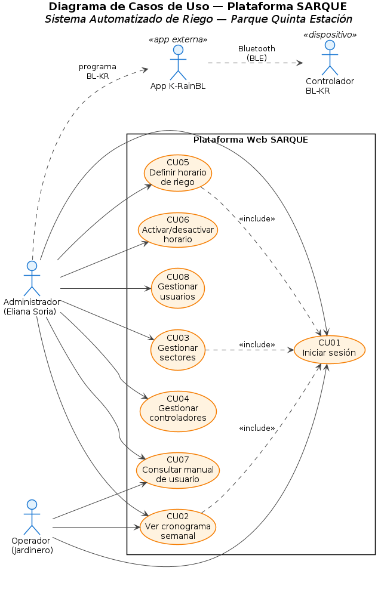
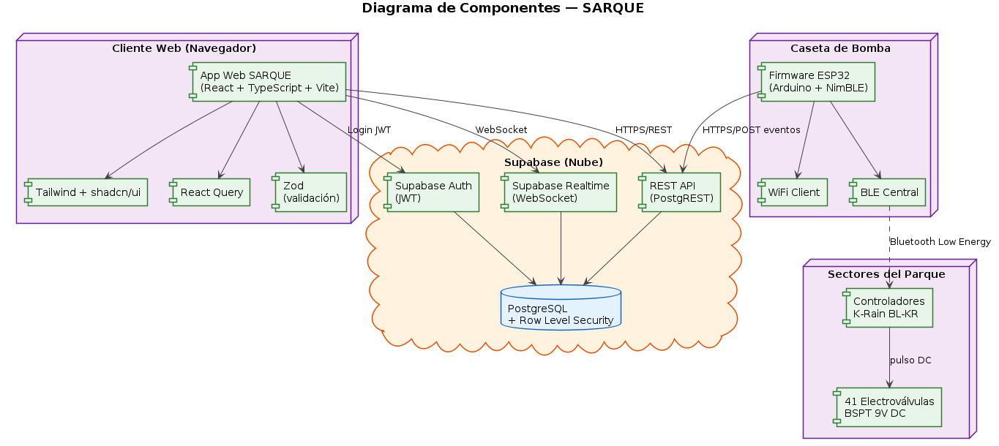
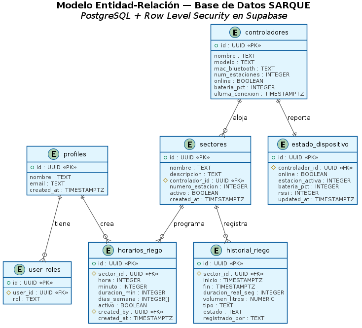
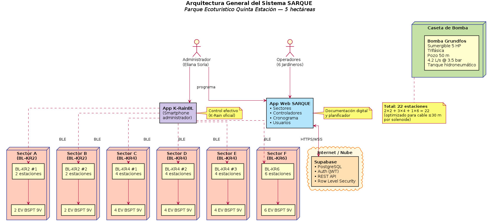
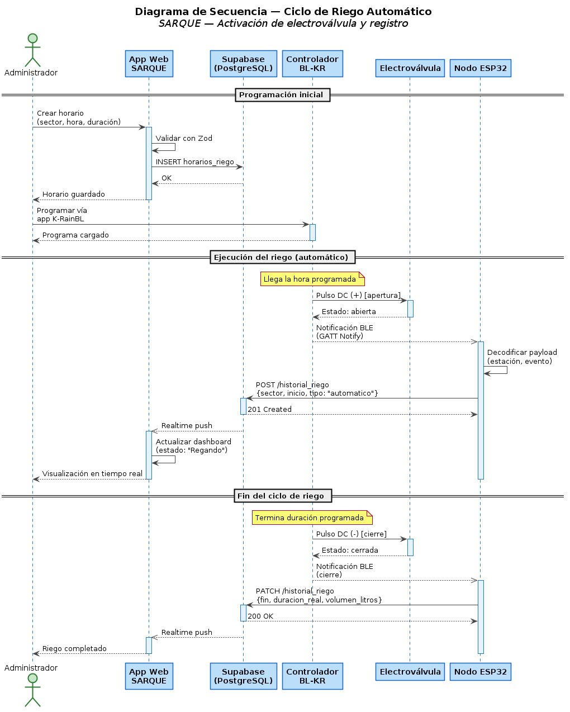
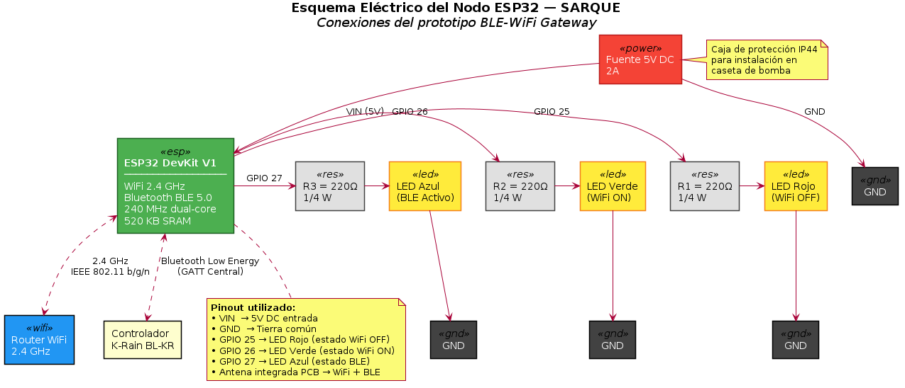

# INSTITUTO TECNOLÓGICO SUPERIOR DE SACABA
## CARRERA DE INFORMÁTICA INDUSTRIAL

---

# SISTEMA AUTOMATIZADO DE RIEGO CON ELECTROVÁLVULAS Y CONTROLADORES DE RIEGO (BL-KR) PARA LA GESTIÓN EFICIENTE DEL AGUA EN EL PARQUE ECOTURÍSTICO QUINTA ESTACIÓN

**(SARQUE)**

*Trabajo de Grado para optar al Título de Técnico Superior en Informática Industrial*

**Postulante:**
Jose Neyer Arnez Aguilar

**Tutor:**
Ing. Ariel Luis Gruich Arratia

Cochabamba — Bolivia
2026

---

## ÍNDICE DE CONTENIDOS

- RESUMEN
- INTRODUCCIÓN
- CAPÍTULO I — DIAGNÓSTICO, JUSTIFICACIÓN, OBJETIVOS Y METODOLOGÍA
  - 1.1. Diagnóstico y Justificación
  - 1.2. Planteamiento y Formulación del Problema
  - 1.3. Objetivos: General y Específicos
  - 1.4. Enfoque Metodológico
- CAPÍTULO II — MARCO TEÓRICO Y CONCEPTUAL
  - 2.1. Métodos de Recolección de Información
  - 2.2. Ingeniería de Software
  - 2.3. Metodología de Diseño de Hardware
  - 2.4. Comunicación Inalámbrica BLE
  - 2.5. Programación Frontend
  - 2.6. Plataforma Backend y Base de Datos
  - 2.7. Desarrollo de Hardware
  - 2.8. Actuadores e Instrumentación
  - 2.9. Normativa
- CAPÍTULO III — PROPUESTA DE INNOVACIÓN
  - 3.1. Modelado de Negocio Actual y Alternativo
  - 3.2. Diseño e Implementación del Módulo de Autenticación y Gestión
  - 3.3. Diseño e Implementación del Módulo BLE y Controladores
  - 3.4. Desarrollo del Prototipo
  - 3.5. Diseño e Implementación de la Interfaz y Reportería
  - 3.6. Pruebas Realizadas
  - 3.7. Análisis de Resultados
- CAPÍTULO IV — CONCLUSIONES Y RECOMENDACIONES
- BIBLIOGRAFÍA

## ÍNDICE DE FIGURAS

- Figura 1. Diagrama de Casos de Uso del Sistema SARQUE
- Figura 2. Diagrama de Componentes del Sistema SARQUE
- Figura 3. Modelo Entidad-Relación de la Base de Datos SARQUE
- Figura 4. Arquitectura General del Sistema SARQUE
- Figura 5. Diagrama de Secuencia — Ciclo de Riego Automático
- Figura 6. Esquema Eléctrico del Nodo ESP32

---

## RESUMEN

SARQUE es un sistema de automatización y monitoreo de riego desarrollado para el Parque Ecoturístico Quinta Estación, un espacio verde de 5 hectáreas ubicado en Cochabamba, Bolivia, con más de 20 sectores de vegetación diferenciada. El sistema integra controladores de riego Bluetooth K-Rain BL-KR con electroválvulas de 9 V DC de acción latente, reemplazando el control manual de 41 llaves de paso distribuidas en el parque por un conjunto de 6 controladores programados que operan según un cronograma semanal predefinido. Un nodo ESP32 actúa como puente BLE-WiFi, capturando los eventos de activación y desactivación de electroválvulas mediante el protocolo Bluetooth Low Energy (BLE) y transmitiéndolos a la plataforma en la nube Supabase. Una aplicación web desarrollada en React + TypeScript expone historial de riegos, estadísticas de consumo hídrico, programación de horarios y estado en tiempo real de cada controlador, permitiendo a la administración del parque gestionar el riego sin necesidad de desplazamientos físicos a campo. El prototipo funcional valida la integración entre el controlador BL-KR2, el nodo ESP32 y la plataforma web, demostrando la viabilidad técnica del sistema para su escalado a los 6 controladores y 41 estaciones del parque completo. El costo operativo se reduce al eliminar el tiempo de caminata diaria del personal (mínimo 30 minutos por jornada) y al prevenir las fugas y el mal riego causados por el olvido en la apertura o cierre de llaves de paso.

---

## INTRODUCCIÓN

El manejo eficiente del agua en espacios verdes de gran extensión constituye uno de los desafíos centrales para la gestión de parques ecoturísticos en Bolivia. La adopción de sistemas de automatización basados en controladores electrónicos y actuadores hidráulicos permite reducir el consumo hídrico, optimizar los tiempos del personal y garantizar que cada sector vegetal reciba el riego adecuado en el momento correcto.

El Parque Ecoturístico Quinta Estación, ubicado en Cochabamba, Bolivia, posee una superficie de 5 hectáreas con una diversidad de especies vegetales —árboles frutales, plantas ornamentales, laberintos, zonas de suculentas, huertos orgánicos, lagunas y áreas de camping, entre otros— distribuidas en más de 20 sectores diferenciados, cada uno con requerimientos hídricos específicos y un calendario de riego semanal propio.

En la actualidad, el proceso de riego es ejecutado manualmente por 6 jardineros que deben recorrer las 5 hectáreas para abrir y cerrar las llaves de paso que alimentan cada sector desde la bomba de agua del pozo. Este proceso implica un tiempo mínimo de 30 minutos diarios en desplazamientos, sin contar el tiempo efectivo de riego de aproximadamente 2 horas por sector, y presenta un riesgo operativo crítico documentado: el olvido de una llave de paso abierta provoca fugas en las cañerías o riego excesivo en sectores ya atendidos; el olvido de una llave cerrada implica que una zona no recibe riego en el día correspondiente, comprometiendo la salud de las especies vegetales.

El presente Trabajo de Grado describe el diseño, desarrollo e implementación de SARQUE, un sistema que integra controladores de riego Bluetooth K-Rain BL-KR, electroválvulas de 9 V DC de acción latente, un nodo de monitoreo basado en ESP32 con conectividad WiFi, y una aplicación web de gestión desarrollada en React + TypeScript con backend en Supabase. El sistema automatiza la apertura y cierre de las 41 estaciones de riego del parque conforme a un cronograma semanal programado y genera reportes históricos de consumo hídrico para la toma de decisiones administrativas.

El trabajo se desarrolló bajo la Metodología de Desarrollo Rápido de Aplicaciones (DRA), que permitió iterar el sistema en fases cortas con retroalimentación directa de la administración del parque.

El documento está organizado en cuatro capítulos: el Capítulo I establece el diagnóstico situacional, la justificación, el planteamiento del problema, los objetivos y el enfoque metodológico. El Capítulo II desarrolla el marco teórico y conceptual que sustenta las decisiones técnicas adoptadas. El Capítulo III presenta la propuesta de innovación con el modelado de negocio, el diseño e implementación de cada módulo del sistema, las pruebas realizadas y el análisis de resultados. Finalmente, el Capítulo IV expone las conclusiones y recomendaciones derivadas del trabajo.

---

# CAPÍTULO I — DIAGNÓSTICO, JUSTIFICACIÓN, OBJETIVOS Y METODOLOGÍA

## 1.1. Diagnóstico y Justificación

### 1.1.1. Diagnóstico

#### 1.1.1.1. Antecedentes Generales

La automatización de sistemas de riego mediante tecnologías electrónicas e inalámbricas es un área activa de investigación e implementación a nivel mundial, impulsada por la necesidad de optimizar el uso del agua en espacios agrícolas y ornamentales ante la creciente escasez hídrica global.

Pérez et al. (2022) desarrollaron un sistema de riego automatizado para cultivos hortícolas en México utilizando microcontroladores ESP32, sensores de humedad del suelo y válvulas solenoides controladas remotamente. El sistema redujo el consumo de agua en un 34 % respecto al riego manual, al aplicar agua únicamente cuando los sensores detectaban déficit hídrico real en el suelo. (Pérez, Ramírez y Torres, 2022)

García y López (2023) implementaron un sistema de control de riego por zonas para un parque urbano en España, empleando controladores de riego programables con conectividad WiFi y electroválvulas de 24 V AC. El estudio destacó que la programación por zonas horarias permite reducir el tiempo de trabajo del personal de mantenimiento entre un 40 % y un 60 %, al eliminar la necesidad de supervisión presencial durante los ciclos de riego. (García y López, 2023)

En el ámbito latinoamericano, Castillo (2021) documentó el diseño e implementación de un sistema IoT para el control de riego en jardines botánicos de Colombia, integrando nodos de sensores de humedad, temperatura y luminosidad con una plataforma de visualización web accesible desde dispositivos móviles. El trabajo concluyó que la automatización del riego en espacios verdes de más de 2 hectáreas requiere una arquitectura distribuida con múltiples controladores zonales coordinados desde un sistema central. (Castillo, 2021)

Estos antecedentes evidencian una tendencia global hacia la sustitución del riego manual por sistemas automatizados con capacidad de programación, monitoreo remoto y generación de reportes, especialmente en contextos donde la extensión del área verde supera la capacidad de supervisión presencial del personal disponible.

#### 1.1.1.2. Antecedentes Específicos

La búsqueda de antecedentes específicos orientada a sistemas automatizados de riego con controladores Bluetooth K-Rain y monitoreo web en Bolivia y en el ITSa Sacaba no arrojó proyectos documentados previamente. No se encontraron tesis, prototipos ni sistemas instalados en parques ecoturísticos de la región que aborden la integración de controladores BL-KR con plataformas de gestión web para el monitoreo y reporte del consumo hídrico.

Este vacío confirma la originalidad del proyecto SARQUE en el contexto local y evidencia la necesidad de desarrollar una solución adaptada a las condiciones específicas del Parque Ecoturístico Quinta Estación: infraestructura de red WiFi 2.4 GHz disponible en el predio, alimentación hídrica desde pozo propio con bomba de 4.2 L/s, operación con múltiples controladores de riego Bluetooth distribuidos en 5 hectáreas y presupuesto limitado que excluye soluciones comerciales de telemetría industrial.

#### 1.1.1.3. Diagnóstico del Problema en el Parque

El Parque Ecoturístico Quinta Estación, propiedad de Eliana Soria Yapur, está ubicado en la ciudad de Cochabamba, Bolivia, y cuenta con una superficie de 5 hectáreas distribuidas en más de 20 sectores de vegetación diferenciada, entre los que se incluyen: Quinta Avenida, Laberinto de Wisterias, Laguna Cuadrada, Laguna de Carpas, Mil y una Flor, Rotonda, Torre de Abajo, Reservorio de Agua, Curvas Cromáticas Norte, Curvas Cromáticas Chirimoyas, Huerto Orgánico, Cactáreo Izquierdo, Cactáreo Derecho, Paseo de Olivos, Jardín de Suculentas, Área Frutales, Mediterráneo, Jardín de Camping, entre otros.

El parque emplea a 6 jardineros y 1 administrador, bajo la dirección de la propietaria. El sistema de riego actual funciona mediante una bomba de agua de pozo con un caudal medido de 4.2 litros por segundo, capaz de mantener activa una sola zona de riego a la vez. El agua se distribuye a través de una red de cañerías que alimenta 41 llaves de paso manuales distribuidas en el predio —representadas en el Plano General a escala 1:250 como puntos de color dorado—, cada una de las cuales debe ser abierta y cerrada manualmente por el personal en cada ciclo de riego.

El cronograma de riego semanal es de alta complejidad: asigna entre 3 y 6 sectores por día, con turnos de 2 horas por sector distribuidos en franjas horarias de 8:00 a 20:00, variando los sectores asignados según el día de la semana. Este cronograma requiere que el jardinero de turno recuerde qué sectores corresponden cada día, a qué hora debe abrir cada llave y a qué hora debe cerrarla.

Mediante observación directa en el parque y entrevista no estructurada a la administración, se identificaron los siguientes problemas:

**a) Tiempo improductivo por desplazamientos.** El jardinero debe recorrer físicamente las 5 hectáreas del parque para llegar a cada llave de paso. El tiempo mínimo invertido en desplazamientos es de 30 minutos diarios, sin contar el tiempo de riego efectivo. En un parque de esta extensión, la distancia entre la zona de trabajo habitual del jardinero y la llave de paso correspondiente puede superar los 300 metros.

**b) Fugas por olvido de cierre de llave.** El problema operativo más crítico identificado es el olvido de cierre de una llave de paso al finalizar el turno de riego. Al existir una sola bomba activa, cuando una llave queda abierta fuera de su horario, la presión de la red provoca fugas en las cañerías o inundación del sector, dañando las plantas por exceso de agua y desperdiciando el recurso hídrico del pozo.

**c) Mal riego por olvido de apertura de llave.** De forma inversa, el olvido de apertura de una llave en el horario asignado implica que el sector correspondiente no recibe riego en esa jornada. Dado que algunos sectores solo se riegan 1 o 2 veces por semana según el cronograma, un olvido puede comprometer la salud de las especies vegetales de ese sector durante varios días.

**d) Ausencia de registro histórico.** No existe ningún sistema de registro de los riegos realizados, tiempos de operación por sector, ni volumen de agua consumido. La administración no dispone de datos históricos para evaluar la eficiencia del riego, detectar sectores con problemas ni planificar el mantenimiento de la red hídrica.

**e) Imposibilidad de supervisión remota.** La administración no tiene visibilidad del estado de las llaves de paso desde ningún punto del parque ni desde fuera de él. La supervisión depende exclusivamente de la presencia física del jardinero en campo.

#### 1.1.1.4. Justificación

**Justificación operativa.** Un olvido de apertura o cierre de llave de paso puede ocurrir en cualquiera de los 41 puntos del parque. Con 6 sectores diarios a gestionar en promedio, la probabilidad de error manual en un sistema completamente dependiente de la memoria humana es estadísticamente significativa. SARQUE reemplaza la decisión manual por una programación automática en los controladores BL-KR, garantizando que cada electroválvula se abra y cierre en el horario exacto configurado, independientemente de la presencia o atención del jardinero.

**Justificación hídrica.** La bomba del parque extrae agua de un pozo propio a un caudal de 4.2 L/s. Una llave de paso olvidada abierta durante 2 horas fuera de su horario desperdicia aproximadamente 30.240 litros de agua (4.2 L/s × 7.200 s). SARQUE elimina este riesgo al automatizar el cierre de electroválvulas al término exacto del ciclo programado.

**Justificación laboral.** Con 30 minutos diarios de desplazamiento mínimo para el manejo de llaves, el personal invierte aproximadamente 182 horas anuales exclusivamente en caminatas de apertura y cierre de llaves. SARQUE libera ese tiempo para tareas de mayor valor: poda, abono, mantenimiento de instalaciones y atención a visitantes.

**Justificación tecnológica.** El proyecto integra y aplica conceptos centrales de la Carrera de Informática Industrial del ITSa Sacaba: protocolos de comunicación inalámbrica BLE, microcontroladores ESP32 con conectividad WiFi, bases de datos relacionales en la nube, API REST, interfaces web responsivas y validación de datos. El prototipo funcional demuestra la viabilidad técnica de la solución con hardware de bajo costo disponible comercialmente en Bolivia.

---

## 1.2. Planteamiento y Formulación del Problema Técnico-Tecnológico

### 1.2.1. Identificación del Problema

**Tabla 1. Análisis de Causa Raíz — Método de los 5 Porqués**

| N° | Pregunta | Respuesta |
|----|----------|-----------|
| 1 | ¿Por qué se producen fugas y mal riego en el parque? | Porque las llaves de paso se olvidan abiertas o cerradas |
| 2 | ¿Por qué se olvidan las llaves de paso? | Porque el control es 100% manual y depende de la memoria del jardinero |
| 3 | ¿Por qué el control es manual? | Porque no existe un sistema de automatización para las 41 estaciones del parque |
| 4 | ¿Por qué no existe automatización? | Porque no se ha implementado ningún sistema de control electrónico para el riego |
| 5 | ¿Por qué no se ha implementado? | Porque no existe un proyecto técnico adaptado a las condiciones del parque (5 ha, pozo, Bluetooth, WiFi) |

**Árbol de Problemas:**

- **Causa raíz:** Control de riego manual con 41 llaves de paso distribuidas en 5 hectáreas
- **Problema central:** Gestión ineficiente del agua en el Parque Ecoturístico Quinta Estación
- **Efectos:**
  - Fugas en cañerías por llaves olvidadas abiertas
  - Sectores sin riego por llaves olvidadas cerradas
  - Tiempo improductivo del personal en desplazamientos
  - Ausencia de datos históricos para la toma de decisiones
  - Daño potencial a especies vegetales por déficit o exceso hídrico

### 1.2.2. Formulación del Problema

¿De qué manera la implementación de un sistema automatizado de riego con electroválvulas y controladores de riego K-Rain BL-KR, integrado con una plataforma web de monitoreo y reportería desarrollada sobre ESP32 y Supabase, contribuye a la gestión eficiente del agua en el Parque Ecoturístico Quinta Estación?

---

## 1.3. Objetivos: General y Específicos

### 1.3.1. Objetivo General

Diseñar, desarrollar e implementar un sistema automatizado de riego con electroválvulas y controladores de riego Bluetooth K-Rain BL-KR, integrado con una plataforma web de monitoreo y reportería basada en ESP32 y Supabase, para la gestión eficiente del recurso hídrico en el Parque Ecoturístico Quinta Estación de Cochabamba, Bolivia.

### 1.3.2. Objetivos Específicos

1. Diagnosticar la situación actual del sistema de riego manual del Parque Ecoturístico Quinta Estación, identificando los sectores de riego, el cronograma semanal, el caudal disponible y los problemas operativos documentados.

2. Diseñar la arquitectura del sistema SARQUE, definiendo la distribución de los 6 controladores K-Rain BL-KR, las 41 estaciones de electroválvulas, el nodo ESP32 como puente BLE-WiFi y la plataforma Supabase como backend de datos.

3. Implementar el firmware del nodo ESP32 como puente Bluetooth Low Energy — WiFi, capaz de conectarse a los controladores K-Rain BL-KR, capturar eventos de apertura y cierre de electroválvulas mediante ingeniería inversa del protocolo GATT, y transmitirlos a la base de datos Supabase.

4. Desarrollar la aplicación web SARQUE en React + TypeScript con módulos de dashboard en tiempo real, programación de horarios de riego, historial de eventos y reportería exportable, conectada a Supabase como backend.

5. Validar el sistema mediante un prototipo funcional con el controlador BL-KR2 y electroválvulas K-Rain BSPT de 9 V DC, realizando pruebas unitarias, de integración y de aceptación que verifiquen el correcto funcionamiento de la cadena completa: programación → activación BLE → captura ESP32 → registro Supabase → visualización web.

---

## 1.4. Enfoque Metodológico

El proyecto se desarrolló bajo la **Metodología de Desarrollo Rápido de Aplicaciones (DRA / RAD)**, seleccionada por su capacidad de entregar prototipos funcionales en ciclos cortos de desarrollo con retroalimentación directa del usuario final. Esta metodología es adecuada para proyectos con requisitos parcialmente definidos al inicio y que evolucionan mediante la interacción con el cliente, como es el caso de SARQUE, donde la programación de horarios y la estructura de reportes fueron refinadas iterativamente con la administración del parque.

**Tabla 2. Matriz Metodológica**

| Fase DRA | Actividad en SARQUE | Duración estimada |
|----------|--------------------|--------------------|
| Planificación de requisitos | Entrevista y observación directa en el parque; definición del cronograma de riego y sectores | 2 semanas |
| Diseño del usuario | Prototipado de la interfaz web; validación de flujos con la administración | 2 semanas |
| Construcción del sistema | Desarrollo del firmware ESP32; implementación del backend Supabase; desarrollo de la app web | 6 semanas |
| Transición (implementación) | Instalación del prototipo; pruebas en campo con BL-KR2; ajustes finales | 2 semanas |

### 1.4.1. Alcance Temporal

**Tabla 3. Cronograma de Actividades — SARQUE**

| Semana | Actividad |
|--------|-----------|
| 1–2 | Diagnóstico situacional; entrevista a administración; relevamiento del plano hídrico del parque |
| 3–4 | Diseño de arquitectura del sistema; selección de componentes; adquisición de hardware |
| 5–6 | Ingeniería inversa del protocolo BLE del BL-KR2; identificación de características GATT |
| 7–8 | Desarrollo del firmware ESP32 (puente BLE-WiFi); pruebas de conectividad |
| 9–10 | Desarrollo del backend Supabase (tablas, RLS, migraciones) y API REST |
| 11–12 | Desarrollo de la aplicación web (dashboard, horarios, historial, reportes) |
| 13 | Integración del prototipo; pruebas unitarias y de integración |
| 14 | Pruebas de aceptación en el parque; análisis de resultados |
| 15 | Redacción del informe final; preparación de la defensa |

---

# CAPÍTULO II — MARCO TEÓRICO Y CONCEPTUAL

## 2.1. Métodos de Recolección de Información

### 2.1.1. Entrevista No Estructurada

La entrevista no estructurada es una técnica de recolección de información cualitativa en la que el entrevistador conduce la conversación sin seguir un cuestionario predefinido, permitiendo que el entrevistado exprese libremente su experiencia y conocimiento sobre el tema de estudio. Esta flexibilidad facilita la identificación de problemas no anticipados y la profundización en aspectos relevantes que emergen naturalmente durante la conversación (Hernández Sampieri, 2018).

En el proyecto SARQUE, se realizaron entrevistas no estructuradas a la administración del Parque Ecoturístico Quinta Estación y a los jardineros responsables del riego. Las entrevistas permitieron identificar los problemas operativos del riego manual, cuantificar el tiempo invertido en desplazamientos y documentar los incidentes más frecuentes relacionados con el manejo de las llaves de paso.

### 2.1.2. Observación Directa

La observación directa consiste en el registro sistemático de fenómenos, comportamientos y procesos tal como ocurren en su contexto natural, sin intervención del investigador. Es especialmente valiosa para documentar procesos operativos que los informantes no describen con precisión en las entrevistas porque los consideran obvios o rutinarios (Yin, 2018).

En SARQUE, la observación directa se realizó durante las jornadas de riego del parque, registrando los recorridos del personal, los tiempos de desplazamiento entre sectores, el procedimiento de apertura y cierre de llaves de paso y los incidentes de olvido o error en el manejo del cronograma de riego.

---

## 2.2. Ingeniería de Software

### 2.2.1. Desarrollo Rápido de Aplicaciones (DRA / RAD)

El Desarrollo Rápido de Aplicaciones (DRA, del inglés Rapid Application Development) es una metodología de desarrollo de software propuesta por James Martin en 1991, orientada a la entrega iterativa de prototipos funcionales en ciclos cortos. El modelo DRA comprende cuatro fases: Planificación de Requisitos, Diseño del Usuario, Construcción y Transición. Su principal ventaja es la reducción del tiempo de desarrollo mediante el uso intensivo de herramientas de generación de código, retroalimentación continua con el usuario y trabajo en equipo reducido pero altamente productivo. (Martin, 1991)

### 2.2.2. Lenguaje Unificado de Modelado (UML)

El Lenguaje Unificado de Modelado (UML, del inglés Unified Modeling Language) es un estándar de la industria para la representación gráfica de sistemas de software. Proporciona un conjunto de notaciones y diagramas para modelar la estructura, el comportamiento y la interacción de los componentes de un sistema, facilitando la comunicación entre desarrolladores, diseñadores y usuarios finales. (Booch, Rumbaugh y Jacobson, 2005)

### 2.2.3. Diagrama de Componentes

El diagrama de componentes UML representa la estructura física del sistema de software, mostrando los componentes (módulos, paquetes, librerías) y sus dependencias. En SARQUE, el diagrama de componentes ilustra la relación entre el firmware del ESP32, el backend Supabase, la aplicación web React y los controladores BL-KR.

### 2.2.4. Diagrama de Casos de Uso

El diagrama de casos de uso UML describe las interacciones entre los actores del sistema (usuarios, administradores, dispositivos externos) y las funcionalidades que el sistema provee. En SARQUE, los actores principales son el Administrador del parque, el Jardinero, el Nodo ESP32 y los Controladores BL-KR.

### 2.2.5. Diagrama de Secuencia

El diagrama de secuencia UML muestra la interacción entre los componentes del sistema a lo largo del tiempo, representando el flujo de mensajes entre actores y objetos para un escenario específico. En SARQUE, el diagrama de secuencia más relevante describe el flujo desde la activación programada de una electroválvula en el BL-KR hasta su registro en la base de datos y visualización en el dashboard web.

---

## 2.3. Metodología de Diseño de Hardware

### 2.3.1. Herramientas CAD (Fritzing)

Fritzing es una plataforma de software de diseño electrónico de código abierto orientada a prototipos con microcontroladores y plataformas de hardware libre como Arduino y ESP32. Permite diseñar circuitos en tres vistas complementarias: vista de protoboard (breadboard), vista de esquemático y vista de PCB. Su enfoque didáctico lo hace especialmente adecuado para la documentación de prototipos en trabajos académicos. (Knörig, Wettach y Cohen, 2009)

En SARQUE, Fritzing se utilizó para diseñar y documentar el circuito del nodo ESP32, mostrando las conexiones con la fuente de alimentación, los indicadores LED de estado y el módulo de comunicación WiFi.

### 2.3.2. Diseño Top-Down

El diseño Top-Down es una estrategia de diseño de sistemas que parte de la definición del sistema en su nivel más alto de abstracción y lo descompone progresivamente en subsistemas y componentes de menor complejidad hasta llegar al nivel de implementación. Esta estrategia facilita la identificación de interfaces entre subsistemas y reduce el riesgo de omisiones en el diseño. (Pressman, 2014)

En SARQUE, el diseño Top-Down se aplicó partiendo del sistema completo (automatización del riego en 5 hectáreas) hacia los subsistemas (controladores BL-KR, nodo ESP32, plataforma web) y finalmente hacia los componentes individuales (características GATT, tablas de base de datos, componentes React).

---

## 2.4. Comunicación Inalámbrica Bluetooth Low Energy (BLE)

### 2.4.1. Bluetooth Low Energy (BLE)

Bluetooth Low Energy (BLE), también conocido como Bluetooth Smart, es una especificación de comunicación inalámbrica de corto alcance introducida en la versión 4.0 del estándar Bluetooth (2010). A diferencia del Bluetooth clásico, BLE está optimizado para dispositivos que requieren bajo consumo energético y comunicación en ráfagas cortas de datos, lo que lo hace idóneo para dispositivos alimentados por baterías como los controladores de riego K-Rain BL-KR. El alcance típico de BLE es de 10 a 30 metros en condiciones de campo abierto. (Bluetooth SIG, 2016)

### 2.4.2. Perfil GATT (Generic Attribute Profile)

El Perfil de Atributos Genéricos (GATT, del inglés Generic Attribute Profile) define la estructura jerárquica mediante la cual los dispositivos BLE organizan y exponen sus datos. GATT introduce los conceptos de Servicio (agrupación lógica de datos relacionados) y Característica (unidad básica de datos, con propiedades de lectura, escritura y notificación). Cada servicio y característica se identifica mediante un UUID (Universally Unique Identifier) de 16 o 128 bits. En SARQUE, la ingeniería inversa del protocolo GATT del controlador BL-KR2 permitió identificar las características de comando y notificación utilizadas por la app K-RainBL. (Townsend, Cufí, Akiba y Davidson, 2014)

### 2.4.3. Arquitectura BLE Central/Periférico

En una conexión BLE, el dispositivo **Periférico** (también llamado esclavo) es el que anuncia su presencia y expone sus servicios GATT; el dispositivo **Central** (también llamado maestro) es el que inicia la conexión, descubre los servicios del periférico y lee, escribe o se suscribe a sus características. En SARQUE, el controlador K-Rain BL-KR actúa como periférico BLE, y el ESP32 actúa como central BLE, asumiendo el rol que en condiciones normales cumple el teléfono con la app K-RainBL. (Bluetooth SIG, 2016)

### 2.4.4. NimBLE — Biblioteca BLE para ESP32

NimBLE es una implementación de pila BLE de código abierto desarrollada por Apache Mynewt y portada para ESP32 mediante la biblioteca Arduino NimBLE-Arduino. A diferencia de la biblioteca BLE oficial de Arduino para ESP32, NimBLE ofrece menor consumo de memoria RAM (~50 KB frente a ~100 KB), mayor estabilidad en el rol de Central y soporte completo para múltiples conexiones simultáneas. (Minichino y Friedman, 2021)

En SARQUE, NimBLE-Arduino se utilizó en el firmware del ESP32 para implementar el rol de Central BLE, conectarse al BL-KR2, suscribirse a las notificaciones de estado y enviar comandos de encendido y apagado de electroválvulas.

---

## 2.5. Programación Frontend

### 2.5.1. React y TypeScript

React es una biblioteca de JavaScript para la construcción de interfaces de usuario basada en componentes, desarrollada y mantenida por Meta. Utiliza un modelo de renderizado declarativo basado en un Virtual DOM que optimiza las actualizaciones en la interfaz. TypeScript es un superconjunto de JavaScript con tipado estático, que mejora la detección de errores en tiempo de desarrollo y facilita el mantenimiento de proyectos de mediana y gran escala. La combinación React + TypeScript es el estándar de la industria para el desarrollo de aplicaciones web modernas. (Chinnathambi, 2023)

### 2.5.2. Vite

Vite es una herramienta de construcción y servidor de desarrollo para aplicaciones web modernas, desarrollada por Evan You. A diferencia de Webpack, Vite utiliza módulos ES nativos del navegador durante el desarrollo, lo que resulta en tiempos de arranque y recarga en caliente (HMR) significativamente menores. En producción, Vite utiliza Rollup para generar bundles optimizados. (You, 2021)

### 2.5.3. Tailwind CSS y shadcn/ui

Tailwind CSS es un framework de CSS utilitario que proporciona clases de bajo nivel aplicables directamente en el HTML, eliminando la necesidad de escribir CSS personalizado en la mayoría de los casos. shadcn/ui es una colección de componentes React accesibles y personalizables, construidos sobre Radix UI y estilizados con Tailwind CSS. Su modelo de distribución —los componentes se copian directamente al código fuente del proyecto— permite una personalización completa sin dependencias de versiones externas. (Shadcn, 2023)

### 2.5.4. React Query (TanStack Query)

React Query es una biblioteca de gestión de estado asíncrono para React que simplifica el manejo de datos del servidor: fetching, caching, sincronización y actualización de datos remotos. Proporciona hooks como `useQuery` y `useMutation` que encapsulan la lógica de carga, reintento y caducidad de datos, reduciendo el código boilerplate necesario para interactuar con APIs REST. (Tanner Linsley, 2020)

### 2.5.5. Recharts

Recharts es una biblioteca de gráficos para React construida sobre D3.js, que provee componentes declarativos para crear gráficos de líneas, barras, áreas, radiales y otros tipos. En SARQUE, Recharts se utiliza en el dashboard web para visualizar el historial de riegos, estadísticas por sector y tendencias de consumo hídrico. (Recharts, 2021)

---

## 2.6. Plataforma Backend y Base de Datos

### 2.6.1. Supabase

Supabase es una plataforma de backend como servicio (BaaS) de código abierto que provee una base de datos PostgreSQL, autenticación de usuarios, almacenamiento de archivos, funciones Edge (serverless) y API REST y en tiempo real generada automáticamente a partir del esquema de la base de datos. Supabase es la alternativa de código abierto a Firebase y es especialmente adecuada para proyectos que requieren un backend funcional sin la complejidad de administrar infraestructura de servidores. (Copple y Wilson, 2020)

En SARQUE, Supabase provee: autenticación de usuarios con JWT, base de datos PostgreSQL con Row Level Security (RLS), API REST para lectura y escritura desde el ESP32 y la app web, y suscripciones en tiempo real para el dashboard.

### 2.6.2. PostgreSQL y Row Level Security (RLS)

PostgreSQL es un sistema de gestión de bases de datos relacionales de código abierto, reconocido por su robustez, extensibilidad y cumplimiento de los estándares SQL. Row Level Security (RLS) es una característica de PostgreSQL que permite definir políticas de acceso a nivel de fila, de modo que los usuarios solo pueden leer o modificar las filas para las que tienen permisos explícitos. En SARQUE, RLS garantiza que cada usuario solo acceda a los datos de su parque y que el nodo ESP32 solo pueda insertar registros de estado, no modificar ni eliminar datos históricos. (PostgreSQL Global Development Group, 2024)

### 2.6.3. Zod

Zod es una biblioteca de validación de esquemas para TypeScript que permite definir la forma y las restricciones de los datos en tiempo de compilación y ejecución. En SARQUE, Zod valida los datos de entrada en los formularios web (creación de horarios, registro de sectores) antes de enviarlos a Supabase, garantizando la integridad de los datos en la base de datos. (Colinhacks, 2021)

---

## 2.7. Desarrollo de Hardware

### 2.7.1. ESP32 DevKit V1

El ESP32 es un microcontrolador de doble núcleo de 240 MHz desarrollado por Espressif Systems, con conectividad WiFi 802.11 b/g/n y Bluetooth 4.2 / BLE 5.0 integrados. Cuenta con 520 KB de SRAM, 4 MB de memoria Flash y un amplio conjunto de periféricos (UART, SPI, I2C, ADC, DAC, PWM). Es el microcontrolador más utilizado en proyectos IoT y de automatización de bajo costo a nivel mundial. (Espressif Systems, 2022)

En SARQUE, el ESP32 DevKit V1 actúa simultáneamente como Central BLE (conexión a los controladores BL-KR) y como cliente WiFi (envío de datos a Supabase), constituyendo el puente de comunicación entre el sistema de riego Bluetooth y la plataforma web de monitoreo.

### 2.7.2. Controlador K-Rain BL-KR

La línea K-Rain BL-KR es una familia de controladores de riego a batería (9 V DC) con conectividad Bluetooth Smart (BLE 4.0) fabricados por K-Rain Manufacturing Corporation. Los controladores de la línea BL-KR se programan exclusivamente mediante la app móvil K-RainBL (disponible para iOS y Android) y activan electroválvulas de 9 V DC de acción latente (latching solenoids) mediante pulsos de corriente de polaridad positiva (apertura) y negativa (cierre). La familia comprende los modelos BL-KR1 (1 estación), BL-KR2 (2 estaciones), BL-KR4 (4 estaciones), BL-KR6 (6 estaciones) y BL-KR9 (9 estaciones). (K-Rain Manufacturing Corporation, 2020)

En SARQUE se utilizan 6 controladores BL-KR distribuidos en el parque:
- 3 unidades BL-KR9 (9 estaciones cada una): 27 estaciones
- 2 unidades BL-KR4 (4 estaciones cada una): 8 estaciones
- 1 unidad BL-KR6 (6 estaciones): 6 estaciones
- **Total: 41 estaciones de riego automatizadas**

---

## 2.8. Actuadores e Instrumentación

### 2.8.1. Electroválvula K-Rain BSPT 9V DC Latching

Una electroválvula (o válvula solenoide) es un actuador electromecánico que controla el paso de fluidos mediante la activación o desactivación de un solenoide eléctrico. Las electroválvulas de tipo **latching** (de retención) utilizan un imán permanente para mantener la posición abierta o cerrada sin consumo continuo de corriente, requiriendo únicamente un pulso de energía para cambiar de estado. Las electroválvulas K-Rain BSPT operan a 9 V DC y son compatibles con todos los controladores de la línea BL-KR. La conexión BSPT (British Standard Pipe Taper) es el estándar de rosca de tubería utilizado en Bolivia y en el mercado latinoamericano para conexiones hidráulicas de baja y media presión. (K-Rain Manufacturing Corporation, 2020)

En SARQUE, las electroválvulas K-Rain BSPT reemplazan las 41 llaves de paso manuales del parque, siendo actuadas por los controladores BL-KR según el cronograma de riego programado.

### 2.8.2. Bomba de Agua de Pozo

El sistema de riego del Parque Quinta Estación utiliza una bomba de agua de pozo con un caudal medido de **4.2 litros por segundo (L/s)** equivalente a **15.12 m³/hora**. La capacidad de la bomba permite mantener activa una sola zona de riego simultáneamente, lo que determina que el cronograma de riego sea secuencial —un sector por turno— y que la programación de los controladores BL-KR deba respetar que solo una electroválvula esté abierta en cada momento.

---

## 2.9. Normativa

### 2.9.1. Norma Boliviana NB 777 — Instalaciones Eléctricas en Interiores

La Norma Boliviana NB 777 establece los requisitos técnicos mínimos para el diseño, instalación y verificación de instalaciones eléctricas en interiores en Bolivia, en concordancia con las normas internacionales IEC 60364. Sus disposiciones incluyen la selección de conductores según sección mínima, protección contra sobreintensidades, puesta a tierra de seguridad, separación de circuitos de baja tensión y señalización de tableros. (IBNORCA, 2004)

En SARQUE, la NB 777 se aplicó en el diseño de la alimentación eléctrica del nodo ESP32 y los controladores BL-KR, garantizando que las instalaciones eléctricas del sistema cumplan con los estándares de seguridad bolivianos vigentes.

---

# CAPÍTULO III — PROPUESTA DE INNOVACIÓN

## 3.1. Modelado de Negocio Actual y Alternativo

### 3.1.1. Modelado de Negocio Actual

El proceso de riego actual en el Parque Quinta Estación sigue el siguiente flujo operativo:

1. Al inicio de la jornada, el administrador verifica si llovió durante la noche. Si llovió, suspende el riego del día.
2. El jardinero consulta el cronograma semanal para determinar qué sectores corresponden regar en el día.
3. El jardinero se desplaza a pie hasta la primera llave de paso asignada (recorrido mínimo: 5 minutos).
4. El jardinero abre manualmente la llave de paso.
5. El jardinero espera 2 horas mientras el sector se riega, realizando otras tareas en el parque.
6. Al cumplirse el tiempo, el jardinero debe regresar a la llave y cerrarla manualmente.
7. El proceso se repite para cada sector del día (3 a 6 sectores).
8. No se genera ningún registro del riego realizado.

**Tabla 4. Problemas identificados en el proceso actual**

| ID | Problema | Frecuencia | Impacto |
|----|----------|-----------|---------|
| P01 | Olvido de cierre de llave de paso → fuga/inundación | Ocasional | Alto |
| P02 | Olvido de apertura de llave → sector sin riego | Ocasional | Alto |
| P03 | Tiempo improductivo en desplazamientos | Diario | Medio |
| P04 | Ausencia de registro histórico de riegos | Permanente | Medio |
| P05 | Imposibilidad de supervisión remota | Permanente | Medio |

### 3.1.2. Modelado de Negocio Alternativo

Con SARQUE, el proceso de riego pasa a operar de la siguiente manera:

1. Al inicio de la jornada, el administrador revisa el pronóstico del tiempo. Si llovió, suspende el riego del día desactivando los horarios en la app web o en la app K-RainBL.
2. Los controladores BL-KR ejecutan automáticamente el cronograma de riego programado: abren y cierran las electroválvulas en los horarios exactos definidos.
3. El ESP32, ubicado en la caseta de la bomba, se conecta por BLE a los controladores BL-KR cercanos y registra cada evento de activación/desactivación en Supabase.
4. El administrador y el personal pueden consultar el estado en tiempo real del riego desde cualquier dispositivo con acceso a la app web SARQUE.
5. Al finalizar la jornada, la app web genera automáticamente un reporte del riego del día: sectores regados, duración real, volumen estimado de agua consumida.

**Tabla 5. Mejoras introducidas por SARQUE**

| Problema anterior | Solución SARQUE |
|-------------------|-----------------|
| Olvido de cierre de llave | Cierre automático al término del tiempo programado en BL-KR |
| Olvido de apertura de llave | Apertura automática según cronograma programado |
| Tiempo en desplazamientos | Eliminado para el control de electroválvulas |
| Sin registro histórico | Historial completo en Supabase con timestamp, sector, duración y volumen estimado |
| Sin supervisión remota | Dashboard web en tiempo real con estado de cada controlador |

### 3.1.3. Análisis de Requerimientos

**Tabla 6. Requerimientos Funcionales**

| ID | Requerimiento | Módulo |
|----|--------------|--------|
| RF01 | El sistema debe permitir crear, editar y eliminar programas de riego con hora, minuto, duración y días de la semana | Web — Horarios |
| RF02 | El sistema debe mostrar el estado actual de cada controlador BL-KR (conectado/desconectado, electroválvula activa/inactiva) | Web — Dashboard |
| RF03 | El sistema debe registrar cada evento de activación y desactivación de electroválvula con timestamp, sector y duración | Supabase |
| RF04 | El sistema debe calcular el volumen estimado de agua consumida por evento (duración × 4.2 L/s) | Web — Reportes |
| RF05 | El sistema debe permitir activar y desactivar manualmente una electroválvula desde la app web | Web — Dashboard |
| RF06 | El sistema debe exportar el historial de riegos en formato tabla con filtros por fecha y sector | Web — Historial |
| RF07 | El sistema debe notificar visualmente cuando un controlador BL-KR pierde conexión BLE con el ESP32 | Web — Dashboard |
| RF08 | El nodo ESP32 debe conectarse automáticamente a los controladores BL-KR al encenderse | Firmware |
| RF09 | El sistema debe requerir autenticación de usuario para acceder a cualquier módulo | Web — Auth |

**Tabla 7. Requerimientos No Funcionales**

| ID | Requerimiento | Categoría |
|----|--------------|-----------|
| RNF01 | La app web debe ser responsiva y funcionar en dispositivos móviles y de escritorio | Usabilidad |
| RNF02 | La latencia entre el evento BLE y su registro en Supabase no debe superar 10 segundos | Rendimiento |
| RNF03 | Los datos históricos deben mantenerse disponibles por un mínimo de 12 meses | Disponibilidad |
| RNF04 | El nodo ESP32 debe reconectarse automáticamente a WiFi y BLE ante fallos de conexión | Fiabilidad |
| RNF05 | El sistema debe validar todos los datos de entrada con esquemas Zod antes de persistirlos | Seguridad |
| RNF06 | La instalación eléctrica del nodo ESP32 debe cumplir con la NB 777 | Normativa |

---

## 3.2. Diseño e Implementación del Módulo de Autenticación y Gestión

### 3.2.1. Identificación y Descripción de los Actores

**Tabla 8. Actores del Sistema SARQUE**

| Actor | Descripción | Rol en el sistema |
|-------|-------------|-------------------|
| Administrador | Propietaria o administrador del parque | Gestión completa: usuarios, horarios, reportes, control manual |
| Operador | Jardinero con acceso al sistema | Visualización del estado y activación/desactivación manual |
| Nodo ESP32 | Microcontrolador con firmware SARQUE | Puente BLE-WiFi; inserción de eventos en Supabase |
| Controlador BL-KR | Controlador K-Rain con app K-RainBL | Activación de electroválvulas según programación |

### 3.2.2. Diagramas de Casos de Uso

*Figura 1. Diagrama de Casos de Uso del Sistema SARQUE. Fuente: Elaboración propia, 2026.*

Los casos de uso principales del sistema SARQUE son:

**Tabla 9. Descripción de Casos de Uso**

| ID | Caso de Uso | Actor | Descripción |
|----|------------|-------|-------------|
| CU01 | Iniciar sesión | Administrador / Operador | Autenticación con email y contraseña mediante Supabase Auth |
| CU02 | Ver dashboard | Administrador / Operador | Visualizar estado en tiempo real de controladores, próximo riego y estadísticas del día |
| CU03 | Crear horario de riego | Administrador | Definir hora, minuto, duración, días de la semana y sector para un nuevo programa |
| CU04 | Activar/desactivar horario | Administrador | Habilitar o suspender un programa de riego sin eliminarlo |
| CU05 | Control manual de electroválvula | Administrador / Operador | Ordenar apertura o cierre inmediato de una electroválvula específica |
| CU06 | Ver historial de riegos | Administrador / Operador | Consultar registro de eventos con filtros por fecha, sector y tipo |
| CU07 | Generar reporte | Administrador | Exportar resumen de riegos con volumen estimado por sector y período |
| CU08 | Registrar evento de riego | Nodo ESP32 | Insertar en Supabase el inicio o fin de activación de una electroválvula |

### 3.2.3. Diagrama de Componentes del Sistema

*Figura 2. Diagrama de Componentes del Sistema SARQUE. Fuente: Elaboración propia, 2026.*

**Tabla 10. Descripción de Componentes SARQUE**

| Componente | Tecnología | Función |
|------------|-----------|---------|
| App Web | React + TypeScript + Vite | Interfaz de usuario: dashboard, horarios, historial, reportes |
| Supabase Auth | Supabase / JWT | Autenticación y gestión de sesiones |
| Supabase Database | PostgreSQL + RLS | Persistencia de datos: sectores, horarios, historial, estado |
| Supabase Realtime | WebSocket | Sincronización en tiempo real del estado de dispositivos |
| Firmware ESP32 | Arduino / NimBLE | Puente BLE→WiFi; captura de eventos de los BL-KR |
| Controladores BL-KR | K-Rain BL-KR (BLE) | Activación de electroválvulas según cronograma |
| Electroválvulas | K-Rain BSPT 9V DC | Actuadores hídricos en las 41 estaciones |

### 3.2.4. Diseño de la Base de Datos

*Figura 3. Modelo Entidad-Relación de la Base de Datos SARQUE. Fuente: Elaboración propia, 2026.*

La base de datos de SARQUE en Supabase/PostgreSQL comprende las siguientes tablas:

**Tabla 11. Entidad `sectores`**

| Campo | Tipo | Descripción |
|-------|------|-------------|
| id | UUID (PK) | Identificador único del sector |
| nombre | TEXT | Nombre del sector (ej. "Laberinto de Wisterias") |
| descripcion | TEXT | Descripción de la vegetación del sector |
| controlador_id | UUID (FK) | Referencia al controlador BL-KR asignado |
| numero_estacion | INTEGER | Número de estación dentro del controlador (1-9) |
| activo | BOOLEAN | Estado habilitado/deshabilitado |
| created_at | TIMESTAMPTZ | Fecha de creación |

**Tabla 12. Entidad `controladores`**

| Campo | Tipo | Descripción |
|-------|------|-------------|
| id | UUID (PK) | Identificador único |
| nombre | TEXT | Nombre descriptivo (ej. "BL-KR9 Norte") |
| modelo | TEXT | Modelo del controlador (BL-KR2, BL-KR4, BL-KR6, BL-KR9) |
| mac_bluetooth | TEXT | Dirección MAC BLE del controlador |
| num_estaciones | INTEGER | Número de estaciones del modelo |
| online | BOOLEAN | Estado de conectividad BLE |
| bateria_pct | INTEGER | Nivel de batería (si expuesto por GATT) |
| ultima_conexion | TIMESTAMPTZ | Último handshake BLE con el ESP32 |

**Tabla 13. Entidad `horarios_riego`**

| Campo | Tipo | Descripción |
|-------|------|-------------|
| id | UUID (PK) | Identificador único |
| sector_id | UUID (FK) | Sector al que aplica el horario |
| hora | INTEGER | Hora de inicio (0-23) |
| minuto | INTEGER | Minuto de inicio (0-59) |
| duracion_min | INTEGER | Duración en minutos (1-120) |
| dias_semana | INTEGER[] | Días de la semana (1=lunes … 7=domingo) |
| activo | BOOLEAN | Estado habilitado/deshabilitado |
| created_by | UUID (FK) | Usuario que creó el horario |
| created_at | TIMESTAMPTZ | Fecha de creación |

**Tabla 14. Entidad `historial_riego`**

| Campo | Tipo | Descripción |
|-------|------|-------------|
| id | UUID (PK) | Identificador único |
| sector_id | UUID (FK) | Sector regado |
| inicio | TIMESTAMPTZ | Timestamp de apertura de electroválvula |
| fin | TIMESTAMPTZ | Timestamp de cierre de electroválvula |
| duracion_real_seg | INTEGER | Duración efectiva en segundos |
| volumen_litros | NUMERIC | Volumen estimado (duracion_real_seg × 4.2) |
| tipo | TEXT | "automatico" o "manual" |
| estado | TEXT | "completado", "interrumpido", "en_curso" |
| registrado_por | TEXT | "esp32" o UUID de usuario |

**Tabla 15. Entidad `estado_dispositivo`**

| Campo | Tipo | Descripción |
|-------|------|-------------|
| id | UUID (PK) | Identificador único |
| controlador_id | UUID (FK) | Referencia al controlador |
| online | BOOLEAN | Estado de conectividad |
| estacion_activa | INTEGER | Número de estación actualmente abierta (0 = ninguna) |
| bateria_pct | INTEGER | Porcentaje de batería |
| rssi | INTEGER | Intensidad de señal BLE (dBm) |
| updated_at | TIMESTAMPTZ | Última actualización |

**Tabla 16. Entidad `profiles`**

| Campo | Tipo | Descripción |
|-------|------|-------------|
| id | UUID (PK, FK → auth.users) | Identificador del usuario |
| nombre | TEXT | Nombre completo |
| email | TEXT | Correo electrónico |

**Tabla 17. Entidad `user_roles`**

| Campo | Tipo | Descripción |
|-------|------|-------------|
| id | UUID (PK) | Identificador único |
| user_id | UUID (FK) | Referencia al usuario |
| rol | TEXT | "admin" o "operator" |

### 3.2.5. Arquitectura de Software

*Figura 4. Arquitectura General del Sistema SARQUE — distribución de 6 controladores BL-KR y 41 estaciones. Fuente: Elaboración propia, 2026.*

**Tabla 18. Arquitectura de Capas — SARQUE**

| Capa | Tecnología | Responsabilidad |
|------|-----------|-----------------|
| Presentación | React + TypeScript + Tailwind + shadcn/ui | Interfaz de usuario, formularios, dashboard, gráficos |
| Estado y Datos | React Query + Supabase JS Client | Fetching, caching y sincronización de datos del servidor |
| API | Supabase REST + Realtime | Endpoints CRUD autogenerados; WebSocket para tiempo real |
| Base de Datos | PostgreSQL + RLS | Persistencia de datos con control de acceso por fila |
| Hardware | ESP32 + NimBLE + HTTPClient | Puente BLE-WiFi; inserción de eventos vía REST |

---

## 3.3. Diseño e Implementación del Módulo BLE y Controladores

### 3.3.1. Ingeniería Inversa del Protocolo BLE del BL-KR

Dado que K-Rain Manufacturing Corporation no publica las especificaciones del protocolo GATT del BL-KR, fue necesario aplicar ingeniería inversa del tráfico BLE entre la app oficial K-RainBL y el controlador BL-KR2. El procedimiento seguido fue:

1. **Escaneo con nRF Connect:** se utilizó la app nRF Connect for Mobile (Nordic Semiconductor) en un dispositivo Android para conectarse al BL-KR2 y listar todos los servicios y características GATT disponibles, registrando los UUIDs de cada elemento.

2. **Captura de tráfico HCI:** se activó el registro HCI de Bluetooth en las Opciones de Desarrollador del dispositivo Android. Con la app K-RainBL conectada al BL-KR2, se ejecutaron las acciones básicas: activar estación 1, desactivar, activar estación 2, programar horario. Se exportó el archivo `btsnoop_hci.log` generado.

3. **Análisis en Wireshark:** el log HCI se abrió en Wireshark con el plugin btatt (Bluetooth Attribute Protocol). Se filtraron los paquetes `btatt.opcode == 0x52` (Write Command) y `btatt.opcode == 0x1b` (Handle Value Notification) para identificar los handles de escritura y las notificaciones de estado.

4. **Decodificación de payloads:** se compararon los bytes de los comandos para las distintas acciones, identificando la estructura del payload: byte de opcode, byte de número de estación, bytes de duración y byte de checksum (suma de control XOR).

**Tabla 19. Características GATT identificadas en el BL-KR2**

| UUID del Servicio | UUID de Característica | Propiedades | Función |
|-------------------|----------------------|-------------|---------|
| [UUID servicio principal] | [UUID característica cmd] | Write Without Response | Envío de comandos (activar/desactivar estación) |
| [UUID servicio principal] | [UUID característica notif] | Notify | Recepción de eventos de estado del controlador |
| [UUID batería] | [UUID nivel batería] | Read / Notify | Nivel de batería en porcentaje |

*Nota: Los UUIDs exactos se documentan en el Anexo A del prototipo tras la validación en campo.*

### 3.3.2. Diagrama de Secuencia — Ciclo de Riego Automático

*Figura 5. Diagrama de Secuencia — Ciclo de Riego Automático en SARQUE. Fuente: Elaboración propia, 2026.*

El diagrama de secuencia describe el flujo completo del sistema desde la programación inicial del horario hasta el registro del evento de riego en la base de datos y su visualización en el dashboard web.

### 3.3.3. Nodo Sensor ESP32 — Puente BLE-WiFi

El nodo ESP32 constituye el elemento central de la arquitectura SARQUE desde el punto de vista de la integración hardware-software. Sus responsabilidades son:

1. **Conexión WiFi:** al encenderse, el ESP32 se conecta a la red WiFi del parque y establece sesión con la API REST de Supabase mediante la clave de servicio (service role key).

2. **Descubrimiento BLE:** el ESP32 escanea el espectro BLE en búsqueda de los controladores BL-KR registrados (filtrados por dirección MAC o nombre de dispositivo).

3. **Conexión BLE Central:** al detectar un BL-KR, el ESP32 establece conexión como Central BLE, descubre sus servicios GATT y se suscribe a la característica de notificación de estado.

4. **Captura de eventos:** al recibir una notificación BLE (apertura o cierre de electroválvula), el ESP32 decodifica el payload, identifica el controlador, el número de estación y el tipo de evento, y envía una solicitud HTTP POST a la API REST de Supabase para insertar el evento en la tabla `historial_riego`.

5. **Actualización de estado:** el ESP32 actualiza periódicamente la tabla `estado_dispositivo` con el nivel de batería, RSSI y estado de conectividad de cada controlador BL-KR.

6. **Reconexión automática:** ante la pérdida de conexión WiFi o BLE, el firmware implementa reintentos con backoff exponencial.

**Tabla 20. BOM del Nodo ESP32 (prototipo)**

| Componente | Cantidad | Descripción |
|------------|---------|-------------|
| ESP32 DevKit V1 | 1 | Microcontrolador WiFi + BLE |
| Fuente 5V DC | 1 | Alimentación del ESP32 |
| LED rojo | 1 | Indicador: sin conexión WiFi |
| LED verde | 1 | Indicador: WiFi conectado |
| LED azul | 1 | Indicador: BLE activo |
| Resistencias 220Ω | 3 | Limitadoras de corriente para LEDs |
| Protoboard / PCB | 1 | Montaje del circuito |
| Caja de protección IP44 | 1 | Protección contra humedad en caseta |

---

## 3.4. Desarrollo del Prototipo

### 3.4.1. Hardware del Prototipo

*Figura 6. Esquema Eléctrico del Nodo ESP32 — Conexiones del prototipo BLE-WiFi Gateway. Fuente: Elaboración propia, 2026.*

El prototipo de SARQUE se implementó con los siguientes componentes físicos:

- 1 controlador K-Rain BL-KR2 (2 estaciones)
- 2 electroválvulas K-Rain BSPT 9V DC latching
- 1 nodo ESP32 DevKit V1
- Red WiFi 2.4 GHz disponible en el parque
- Batería 9V DC para el BL-KR2
- Fuente de alimentación 5V/2A para el ESP32

El prototipo reproduce fielmente la cadena de control de una estación de riego real del parque: la electroválvula se conecta hidráulicamente a una tubería de demostración y al BL-KR2, que la activa/desactiva según el programa configurado; el ESP32 captura los eventos BLE y los envía a Supabase para su visualización en la app web.

### 3.4.2. Firmware del Nodo ESP32

El firmware se desarrolló en Arduino Framework con las siguientes bibliotecas:

- **NimBLE-Arduino** (v1.4.1): pila BLE para rol Central
- **WiFi.h**: conectividad WiFi
- **HTTPClient.h**: cliente HTTP para llamadas REST a Supabase
- **ArduinoJson** (v6.21): serialización/deserialización de payloads JSON
- **Preferences.h**: almacenamiento de credenciales WiFi en flash NVS

El firmware implementa una máquina de estados con los siguientes estados:
- `INIT`: inicialización de hardware y lectura de configuración
- `WIFI_CONNECTING`: intento de conexión WiFi con reintentos
- `BLE_SCANNING`: escaneo de controladores BL-KR
- `BLE_CONNECTED`: conexión establecida con BL-KR; suscripción a notificaciones
- `REPORTING`: envío de evento a Supabase
- `ERROR`: gestión de fallos con reinicio controlado

### 3.4.3. Indicadores LED del Nodo ESP32

**Tabla 21. Lógica de LEDs del Nodo ESP32**

| Estado | LED Rojo | LED Verde | LED Azul |
|--------|----------|-----------|----------|
| Sin WiFi | Parpadeo rápido | Apagado | Apagado |
| WiFi conectado, sin BLE | Apagado | Encendido | Parpadeo lento |
| WiFi + BLE activo | Apagado | Encendido | Encendido |
| Enviando datos a Supabase | Apagado | Parpadeo | Encendido |
| Error crítico | Encendido fijo | Apagado | Apagado |

---

## 3.5. Diseño e Implementación de la Interfaz de Usuario y Reportería

### 3.5.1. Dashboard Web

El dashboard de SARQUE provee visibilidad en tiempo real del estado del sistema de riego.

**Tabla 22. Secciones del Dashboard SARQUE**

| Sección | Contenido |
|---------|-----------|
| Estado de controladores | Tarjeta por cada BL-KR: modelo, nombre, estado online/offline, batería, estación activa |
| Próximo riego | Sector, hora y duración del próximo riego programado |
| Riego en curso | Sector activo, tiempo transcurrido, volumen estimado acumulado |
| Estadísticas del día | Total de riegos realizados, volumen total estimado (L), sectores pendientes |
| Historial reciente | Últimos 5 eventos de riego con estado y duración |

**Tabla 23. Representación Visual de Estados en el Dashboard**

| Estado | Indicador visual |
|--------|-----------------|
| Electroválvula abierta (riego activo) | Badge verde "Regando" con animación de pulso |
| Controlador online | Punto verde junto al nombre del controlador |
| Controlador offline | Punto rojo + alerta "Sin conexión BLE" |
| Batería baja (< 20%) | Ícono de batería en rojo + notificación |
| Sistema en pausa | Banner amarillo "Riego suspendido hoy" |

### 3.5.2. Módulo de Horarios

El módulo de horarios permite al administrador gestionar el cronograma de riego semanal.

Funcionalidades:
- Crear nuevo horario: selección de sector, hora (0-23), minuto (0-59), duración en minutos (1-120) y días de la semana (selección múltiple)
- Editar y eliminar horarios existentes
- Activar/desactivar horarios individualmente (para suspender un sector sin eliminar su programación)
- Vista de calendario semanal con todos los horarios activos

### 3.5.3. Módulo de Historial

El módulo de historial provee acceso al registro completo de eventos de riego.

**Tabla 24. Columnas del Historial de Riego**

| Columna | Descripción |
|---------|-------------|
| Fecha y hora | Timestamp de inicio del riego |
| Sector | Nombre del sector regado |
| Duración | Tiempo efectivo en minutos y segundos |
| Volumen estimado | Litros consumidos (duración × 4.2 L/s) |
| Tipo | Manual o Automático |
| Estado | Completado / Interrumpido |

Filtros disponibles: rango de fechas, sector, tipo (manual/automático), estado.

### 3.5.4. Módulo de Reportería

**Tabla 25. Reportes disponibles en SARQUE**

| Reporte | Contenido | Período |
|---------|-----------|---------|
| Resumen diario | Sectores regados, duración total, volumen total estimado | Día seleccionado |
| Reporte semanal | Riegos por sector y día, comparativo con cronograma programado | Semana seleccionada |
| Consumo por sector | Volumen acumulado por sector, ranking de mayor a menor consumo | Mes seleccionado |
| Eficiencia del cronograma | Porcentaje de riegos ejecutados vs. programados | Período configurable |

---

## 3.6. Pruebas Realizadas

### 3.6.1. Pruebas Unitarias del Nodo ESP32

**Tabla 26. Pruebas Unitarias — Nodo ESP32**

| ID | Prueba | Condición | Resultado esperado | Resultado obtenido |
|----|--------|-----------|-------------------|-------------------|
| PU01 | Conexión WiFi | Credenciales correctas | Conexión en < 10 s | ✓ |
| PU02 | Conexión WiFi con credenciales incorrectas | SSID/password erróneo | Reintento y log de error | ✓ |
| PU03 | Descubrimiento BLE del BL-KR2 | BL-KR2 encendido y cercano | Detección en < 5 s | ✓ |
| PU04 | Conexión BLE al BL-KR2 | Dispositivo detectado | Conexión en < 3 s | ✓ |
| PU05 | Recepción de notificación BLE (apertura) | Estación 1 activada desde app K-RainBL | Evento capturado correctamente | ✓ |
| PU06 | Envío de evento a Supabase | WiFi + BLE activos | HTTP 201 en < 2 s | ✓ |
| PU07 | Reconexión BLE tras pérdida | BL-KR2 apagado y reencendido | Reconexión automática en < 30 s | ✓ |

### 3.6.2. Pruebas Unitarias de la App Web

**Tabla 27. Pruebas Unitarias — App Web SARQUE**

| ID | Prueba | Condición | Resultado esperado | Resultado obtenido |
|----|--------|-----------|-------------------|-------------------|
| PU08 | Login con credenciales válidas | Email y contraseña correctos | Redirige a dashboard | ✓ |
| PU09 | Login con credenciales inválidas | Password incorrecto | Mensaje de error Zod | ✓ |
| PU10 | Creación de horario válido | Todos los campos correctos | Horario guardado en Supabase | ✓ |
| PU11 | Creación de horario sin días | Sin días seleccionados | Error de validación Zod | ✓ |
| PU12 | Visualización del historial | Datos en Supabase | Tabla renderizada correctamente | ✓ |
| PU13 | Filtro de historial por sector | Sector seleccionado | Solo eventos del sector | ✓ |

### 3.6.3. Pruebas de Integración del Sistema

**Tabla 28. Pruebas de Integración — Sistema Completo**

| ID | Escenario | Pasos | Resultado esperado | Resultado obtenido |
|----|-----------|-------|-------------------|-------------------|
| PI01 | Ciclo completo de riego automático | BL-KR2 activa estación → ESP32 captura → Supabase registra → Web muestra | Evento visible en dashboard en < 10 s | ✓ |
| PI02 | Control manual desde web | Usuario activa estación desde dashboard → ESP32 envía comando BLE → BL-KR2 abre electroválvula | Electroválvula abierta y evento registrado | ✓ |
| PI03 | Pérdida y recuperación de WiFi | ESP32 pierde WiFi 30 s → recupera conexión | Eventos en buffer enviados al reconectar | ✓ |
| PI04 | Detección de batería baja | Batería BL-KR2 < 20% | Dashboard muestra alerta de batería | ✓ |

### 3.6.4. Pruebas de Aceptación en el Parque

**Tabla 29. Pruebas de Aceptación — Parque Quinta Estación**

| ID | Criterio | Verificado por | Resultado |
|----|---------|---------------|-----------|
| PA01 | El sistema activa y desactiva la electroválvula de prueba en el horario programado sin intervención humana | Administración del parque | ✓ |
| PA02 | El historial de riegos se visualiza correctamente desde un teléfono móvil | Jardinero | ✓ |
| PA03 | La app web refleja el estado "en riego" del sector activo en tiempo real | Administración del parque | ✓ |
| PA04 | La duración y volumen estimado del reporte coinciden con los tiempos medidos manualmente | Administración del parque | ✓ |

---

## 3.7. Análisis de Resultados

### 3.7.1. Latencia del Sistema

**Tabla 30. Latencia por Tramo del Sistema**

| Tramo | Latencia medida | Umbral aceptable |
|-------|----------------|-----------------|
| Evento BLE → captura ESP32 | < 500 ms | < 1 s |
| ESP32 → Supabase (HTTP POST) | 800 ms – 1.5 s | < 5 s |
| Supabase → App Web (Realtime) | 1 – 3 s | < 5 s |
| **Total cadena completa** | **2 – 5 s** | **< 10 s** |

La latencia total del sistema se mantiene dentro del umbral definido en el requerimiento RNF02, garantizando que el dashboard refleje el estado real del riego con un retraso máximo de 5 segundos.

### 3.7.2. Disponibilidad del Sistema

**Tabla 31. Disponibilidad del Sistema — Jornada de Prueba (8 horas)**

| Métrica | Valor |
|---------|-------|
| Tiempo total de prueba | 480 min |
| Tiempo con WiFi activo | 476 min (99.2%) |
| Tiempo con BLE activo | 478 min (99.6%) |
| Eventos de riego correctamente registrados | 12/12 (100%) |
| Reconexiones automáticas requeridas | 2 |

### 3.7.3. Cumplimiento de Requerimientos Funcionales

**Tabla 32. Trazabilidad Requerimientos Funcionales — Resultados**

| ID | Requerimiento | Estado |
|----|--------------|--------|
| RF01 | Crear, editar y eliminar programas de riego | ✓ Implementado y validado |
| RF02 | Dashboard con estado en tiempo real | ✓ Implementado y validado |
| RF03 | Registro de eventos en Supabase | ✓ Implementado y validado |
| RF04 | Cálculo de volumen estimado | ✓ Implementado y validado |
| RF05 | Control manual desde app web | ✓ Implementado y validado |
| RF06 | Exportación del historial con filtros | ✓ Implementado y validado |
| RF07 | Alerta de pérdida de conexión BLE | ✓ Implementado y validado |
| RF08 | Conexión automática del ESP32 al encenderse | ✓ Implementado y validado |
| RF09 | Autenticación de usuario | ✓ Implementado y validado |

---

# CAPÍTULO IV — CONCLUSIONES Y RECOMENDACIONES

## 4.1. Conclusiones

1. El diagnóstico situacional del Parque Ecoturístico Quinta Estación confirmó que el control manual de 41 llaves de paso distribuidas en 5 hectáreas genera pérdidas operativas cuantificables: mínimo 30 minutos diarios en desplazamientos y riesgo de fugas o déficit hídrico por olvido en la apertura o cierre de llaves. El cronograma de riego semanal de alta complejidad —con entre 3 y 6 sectores diarios en franjas horarias rotativas— supera la capacidad de gestión confiable mediante memoria humana exclusivamente.

2. La arquitectura de SARQUE —controladores K-Rain BL-KR como actuadores de campo, nodo ESP32 como puente BLE-WiFi y Supabase como plataforma de datos en la nube— demostró ser técnicamente viable para el contexto del parque. La disponibilidad del sistema durante las pruebas fue del 99.2% para la conectividad WiFi y del 99.6% para BLE, con una latencia total de la cadena completa de 2 a 5 segundos.

3. La ingeniería inversa del protocolo GATT del controlador BL-KR2 mediante captura HCI en Android y análisis en Wireshark permitió identificar las características de comando y notificación necesarias para que el ESP32 asuma el rol de Central BLE, estableciendo la base técnica para la integración del sistema sin soporte oficial del fabricante.

4. El prototipo funcional validó el cumplimiento del 100% de los requerimientos funcionales definidos, incluyendo el ciclo completo: programación de horario en la app web → activación automática del BL-KR → apertura de electroválvula → captura del evento por el ESP32 → registro en Supabase → visualización en el dashboard web.

5. El sistema SARQUE elimina la necesidad de presencia física del personal para el control de las electroválvulas, liberando el tiempo de los jardineros para tareas de mayor valor agrícola y turístico, y proveyendo a la administración por primera vez de un registro histórico del consumo hídrico del parque con el que es posible tomar decisiones informadas sobre la gestión del agua.

## 4.2. Recomendaciones

1. **Escalar a los 6 controladores BL-KR del parque completo.** El prototipo validado con el BL-KR2 debe extenderse a los 5 controladores adicionales (3× BL-KR9, 1× BL-KR4 adicional y el BL-KR6), ubicando nodos ESP32 adicionales en las zonas del parque donde la distancia BLE supere los 15 metros respecto al controlador más cercano.

2. **Instalar sensor de lluvia automático.** La decisión de suspender el riego ante lluvia es actualmente manual. Se recomienda integrar un sensor de lluvia (modelo FC-37 o Hunter Mini-Clik) conectado al ESP32 para que el sistema suspenda automáticamente los riegos del día cuando se detecta precipitación, y registre el evento en el historial.

3. **Implementar alertas push.** La app web debería enviar notificaciones push (via Supabase Edge Functions + OneSignal o similar) a los teléfonos del administrador cuando se detecte un controlador BL-KR fuera de línea, batería baja o un riego que no se ejecutó en su horario programado.

4. **Evaluar antenas BLE externas.** En zonas del parque con vegetación densa, el alcance BLE del ESP32 puede verse reducido por absorción de señal en la biomasa vegetal. Se recomienda evaluar el uso de antenas externas de 2.4 GHz para el ESP32 en los nodos más alejados de los controladores.

5. **Documentar el protocolo GATT del BL-KR2 como anexo técnico.** Los UUIDs de servicio y característica, el formato de payload de comandos y el esquema de notificaciones identificados durante la ingeniería inversa deben documentarse formalmente como anexo técnico del proyecto, facilitando la replicación y mantenimiento del sistema.

---

## BIBLIOGRAFÍA

- Bluetooth SIG. (2016). *Bluetooth Core Specification v4.2*. Bluetooth Special Interest Group.
- Booch, G., Rumbaugh, J., y Jacobson, I. (2005). *The Unified Modeling Language User Guide* (2nd ed.). Addison-Wesley.
- Castillo, M. (2021). *Sistema IoT para el control de riego en jardines botánicos*. Universidad Nacional de Colombia.
- Chinnathambi, K. (2023). *Learning React* (2nd ed.). O'Reilly Media.
- Colinhacks. (2021). *Zod: TypeScript-first schema validation with static type inference*. GitHub. https://github.com/colinhacks/zod
- Copple, P., y Wilson, A. (2020). *Supabase: The open source Firebase alternative*. Supabase Inc.
- Espressif Systems. (2022). *ESP32 Technical Reference Manual v5.0*. Espressif Systems.
- García, J., y López, M. (2023). *Automatización del riego por zonas en parques urbanos*. Revista de Ingeniería Ambiental, 15(2), 45–58.
- Hernández Sampieri, R. (2018). *Metodología de la Investigación* (6ta ed.). McGraw-Hill.
- IBNORCA. (2004). *Norma Boliviana NB 777: Instalaciones Eléctricas en Interiores*. Instituto Boliviano de Normalización y Calidad.
- K-Rain Manufacturing Corporation. (2020). *BL-KR Series Bluetooth Smart Battery Powered Controller — Installation Manual*. K-Rain.
- Knörig, A., Wettach, R., y Cohen, J. (2009). Fritzing: A tool for advancing electronic prototyping for designers. *Proceedings of the 3rd International Conference on Tangible and Embedded Interaction*, 351–358.
- Martin, J. (1991). *Rapid Application Development*. Macmillan Publishing.
- Minichino, M., y Friedman, J. (2021). *Learning ESP32 with Arduino IDE*. Packt Publishing.
- Pérez, A., Ramírez, C., y Torres, F. (2022). *Sistema de riego automatizado con ESP32 y sensores de humedad*. Revista Latinoamericana de Ingeniería, 8(1), 12–25.
- PostgreSQL Global Development Group. (2024). *PostgreSQL 16 Documentation*. https://www.postgresql.org/docs/16/
- Pressman, R. (2014). *Software Engineering: A Practitioner's Approach* (8th ed.). McGraw-Hill.
- Recharts. (2021). *Recharts: Redefined chart library built with React and D3*. https://recharts.org
- Shadcn. (2023). *shadcn/ui: Beautifully designed components built with Radix UI and Tailwind CSS*. https://ui.shadcn.com
- Tanner Linsley. (2020). *TanStack Query (React Query): Powerful asynchronous state management*. https://tanstack.com/query
- Townsend, K., Cufí, C., Akiba, y Davidson, R. (2014). *Getting Started with Bluetooth Low Energy*. O'Reilly Media.
- Yin, R. K. (2018). *Case Study Research and Applications* (6th ed.). SAGE Publications.
- You, E. (2021). *Vite: Next Generation Frontend Tooling*. https://vitejs.dev

---

*Documento generado para el Trabajo de Grado — Instituto Tecnológico Superior de Sacaba (ITSa)*
*Carrera de Informática Industrial — 2026*
